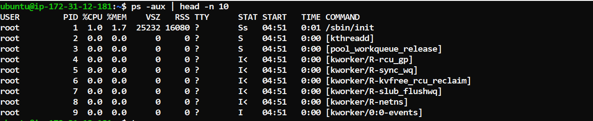
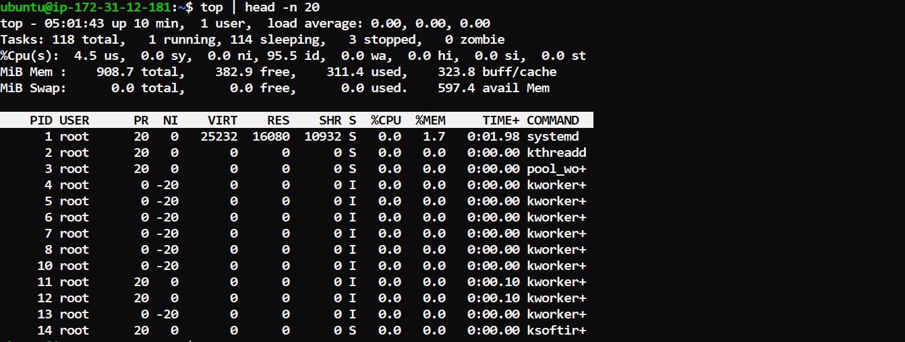
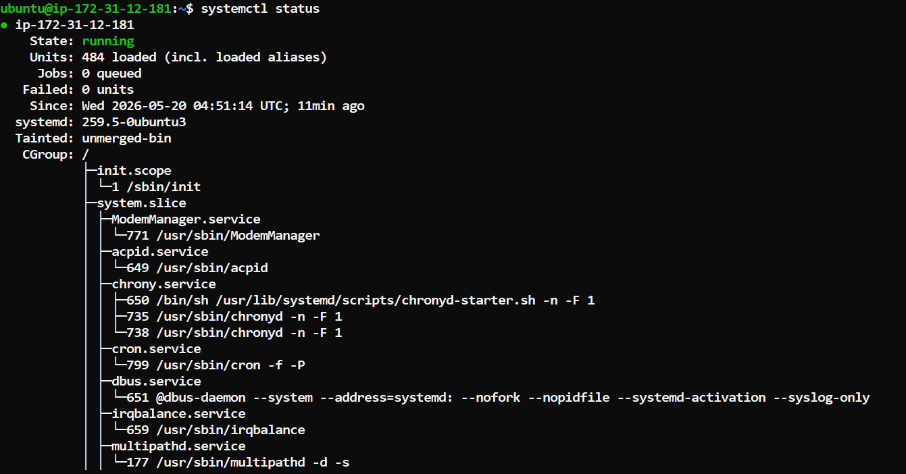
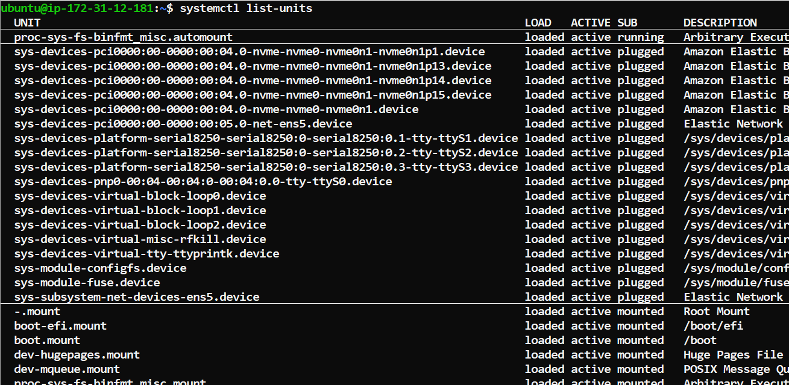
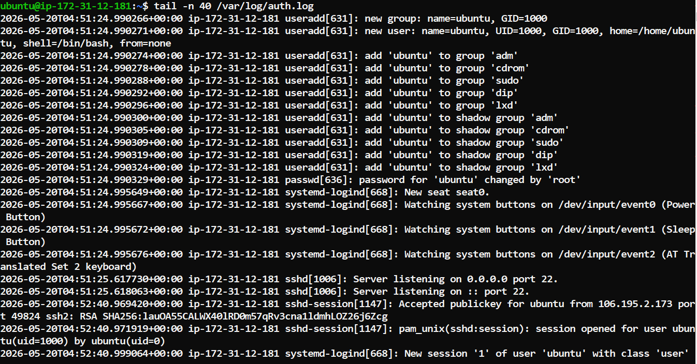

# Real time output of commands I practiced

## Process commands

* `ps aux | head -n 10` - List running processes (top 10 lines).

* `pgrep -x sshd` - Get the process ID by process name.

* `top` - Monitor running processes and system resource usage in real time.

---

## Service commands

* `systemctl status ssh` - Check SSH service status and details.

* `systemctl status | head -n 20` - Prints first 20 lines of system service status summary.

---

## Log commands

* `tail -n 40 /var/log/auth.log` - Displays last 40 lines of authentication logs.

