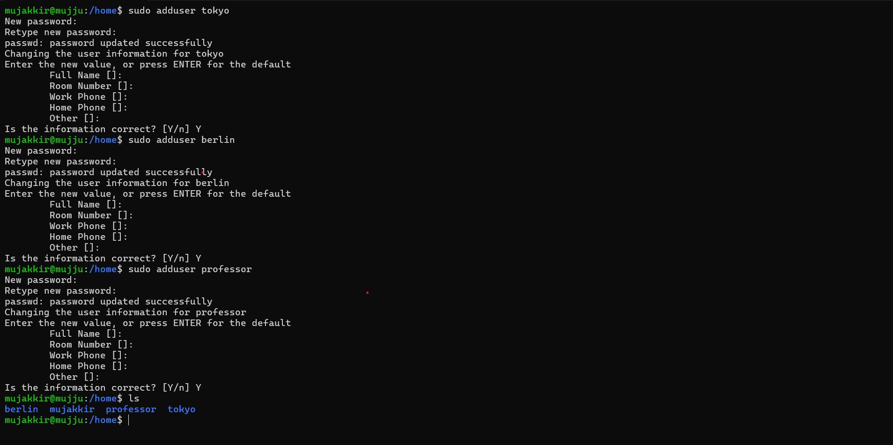
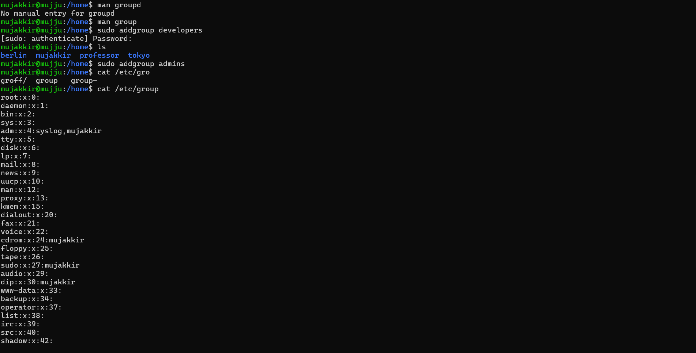
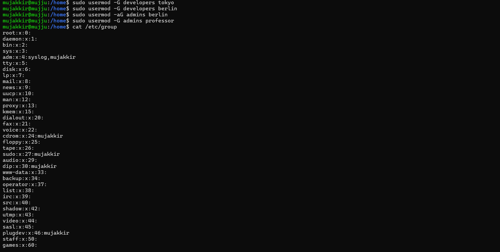
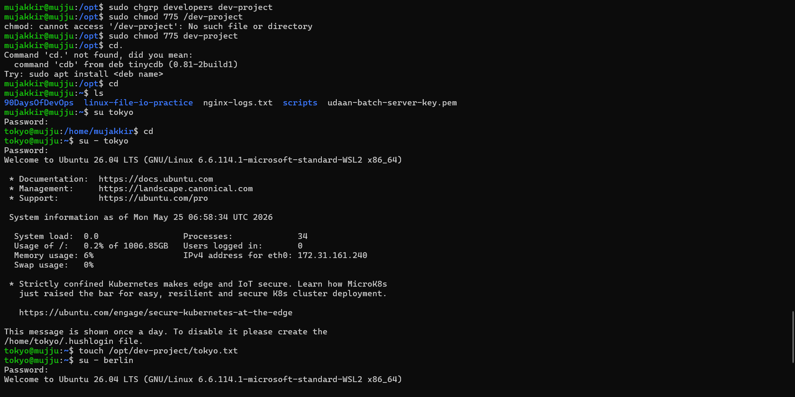

# Day 09 Challenge

## Users & Groups Created

### Users
- tokyo
- berlin
- professor
- nairobi

### Groups
- developers
- admins
- project-team

---

# Task 1: Create Users

## Commands Used

```bash
sudo adduser tokyo
sudo adduser berlin
sudo adduser professor
sudo adduser nairobi
```

## Explanation
- `adduser` → creates a new user
- Automatically creates:
  - home directory
  - default shell
  - user group
- Also asks to set password interactively


## Verification Commands

```bash
cat /etc/passwd
ls /home
```

---

# Task 2: Create Groups

## Commands Used

```bash
sudo addgroup developers
sudo addgroup admins
sudo addgroup project-team
```

## Explanation
- `addgroup` → creates a new group


## Verification Command

```bash
cat /etc/group
```

---

# Task 3: Assign Users to Groups

## Group Assignments
- tokyo → developers, project-team
- berlin → developers, admins
- professor → admins
- nairobi → project-team

## Commands Used

### Add tokyo to developers
```bash
sudo usermod -aG developers tokyo
```

### Add berlin to developers and admins
```bash
sudo usermod -aG developers berlin
sudo usermod -aG admins berlin
```

### Add professor to admins
```bash
sudo usermod -aG admins professor
```

### Add nairobi and tokyo to project-team
```bash
sudo usermod -aG project-team nairobi
sudo usermod -aG project-team tokyo
```

## Explanation
- `usermod` → modifies existing user
- `-a` → append to group
- `-G` → specifies supplementary groups

  

## Verification Commands

```bash
groups tokyo
groups berlin
groups professor
groups nairobi
```

---

# Task 4: Shared Directory

## Create Shared Directory

```bash
sudo mkdir /opt/dev-project
```

## Set Group Owner

```bash
sudo chgrp developers /opt/dev-project
```

## Set Permissions

```bash
sudo chmod 775 /opt/dev-project
```

## Explanation of 775 Permissions

| Number | Permission | Meaning |
|--------|-------------|---------|
| 7 | rwx | read, write, execute |
| 7 | rwx | group can read, write, execute |
| 5 | r-x | others can read and execute only |

Meaning:
- Owner has full access
- Group members have full access
- Others can only view and access


## Test File Creation

### Create file as tokyo
```bash
sudo -u tokyo touch /opt/dev-project/tokyo.txt
```

### Create file as berlin
```bash
sudo -u berlin touch /opt/dev-project/berlin.txt
```

## Verification Commands

```bash
ls -ld /opt/dev-project
ls -l /opt/dev-project
```

---

# Task 5: Team Workspace

## Create Team Workspace Directory

```bash
sudo mkdir /opt/team-workspace
```

## Set Group Ownership

```bash
sudo chgrp project-team /opt/team-workspace
```

## Set Permissions

```bash
sudo chmod 775 /opt/team-workspace
```

## Test File Creation as nairobi

```bash
sudo -u nairobi touch /opt/team-workspace/nairobi.txt
```

## Verification Commands

```bash
ls -ld /opt/team-workspace
ls -l /opt/team-workspace
```

---

# Directories Created

| Directory | Group Owner | Permissions |
|-----------|-------------|-------------|
| /opt/dev-project | developers | 775 (rwxrwxr-x) |
| /opt/team-workspace | project-team | 775 (rwxrwxr-x) |

---

# Commands Used

```bash
adduser
addgroup
usermod
groups
mkdir
chgrp
chmod
touch
ls
cat
```

---

# What I Learned

1. How to create and manage Linux users and groups
2. How to assign users to multiple groups
3. How shared directory permissions work using chmod and chgrp

---

# Troubleshooting

## Permission denied?
Use:
```bash
sudo
```

## User cannot access directory?

Check group membership:
```bash
groups username
```

Check directory permissions:
```bash
ls -ld /path
```

---

# Verification Summary

### Check Users
```bash
cat /etc/passwd
```

### Check Groups
```bash
cat /etc/group
```

### Check Home Directories
```bash
ls /home
```

### Check Shared Directories
```bash
ls -ld /opt/dev-project
ls -ld /opt/team-workspace
```
