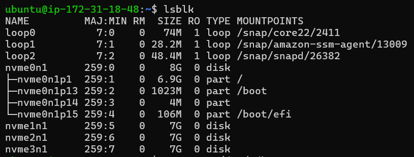
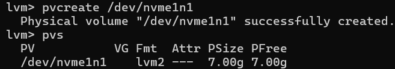
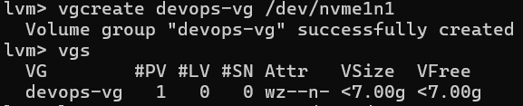
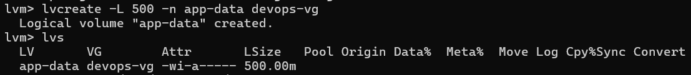
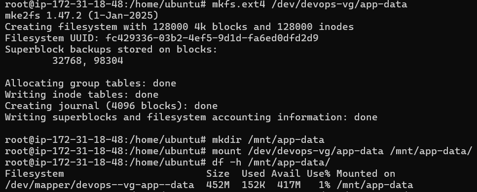
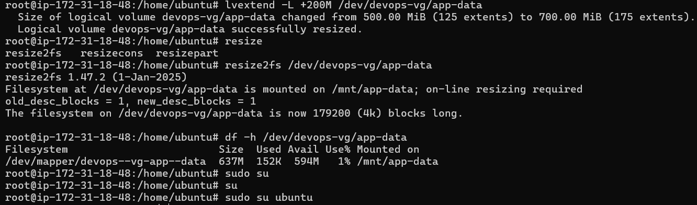

# Day 13 - LVM (Logical Volume Manager)

## Objective

Learn how to create and manage storage using LVM by creating a Physical Volume (PV), Volume Group (VG), Logical Volume (LV), formatting it, mounting it, and extending its size.

---

## Environment

* AWS EC2 Instance (Ubuntu)
* Additional EBS Volume attached for LVM practice

---

## Task 1: Check Current Storage

### Commands Used

```bash
lsblk
pvs
vgs
lvs
df -h
```

### Screenshot



---

## Task 2: Create Physical Volume

### Command Used

```bash
pvcreate /dev/nvme1n1
pvs
```

### Output

```text
Physical volume "/dev/nvme1n1" successfully created.
```

### Screenshot



---

## Task 3: Create Volume Group

### Command Used

```bash
vgcreate devops-vg /dev/nvme1n1
vgs
```

### Output

```text
Volume group "devops-vg" successfully created.
```

### Screenshot

Add screenshot of:



---

## Task 4: Create Logical Volume

### Command Used

```bash
lvcreate -L 500M -n app-data devops-vg
lvs
```

### Output

```text
Logical volume "app-data" created.
```

### Screenshot



---

## Task 5: Format and Mount

### Commands Used

```bash
mkfs.ext4 /dev/devops-vg/app-data

mkdir -p /mnt/app-data

mount /dev/devops-vg/app-data /mnt/app-data

df -h /mnt/app-data
```

### Screenshot

Add screenshot of:



---

## Task 6: Extend the Volume

### Commands Used

```bash
lvextend -L +200M /dev/devops-vg/app-data

resize2fs /dev/devops-vg/app-data

df -h /mnt/app-data
```

### Output

```text
Size of logical volume devops-vg/app-data changed from 500.00 MiB to 700.00 MiB
Logical volume devops-vg/app-data successfully resized.
```

### Final Verification

```text
Filesystem                        Size  Used Avail Use% Mounted on
/dev/mapper/devops--vg-app--data  637M  152K  594M   1% /mnt/app-data
```

### Screenshot



---

## What I Learned

1. A Physical Volume (PV) converts a raw disk into LVM-managed storage.
2. A Volume Group (VG) acts as a storage pool from which Logical Volumes can be created.
3. Logical Volumes can be extended dynamically, and the filesystem can be resized without recreating partitions.

---

## Conclusion

Successfully created and managed LVM storage on an AWS EC2 instance by creating a PV, VG, and LV, formatting and mounting the filesystem, and extending the logical volume from 500 MB to 700 MB.

