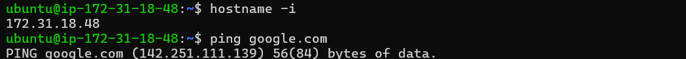
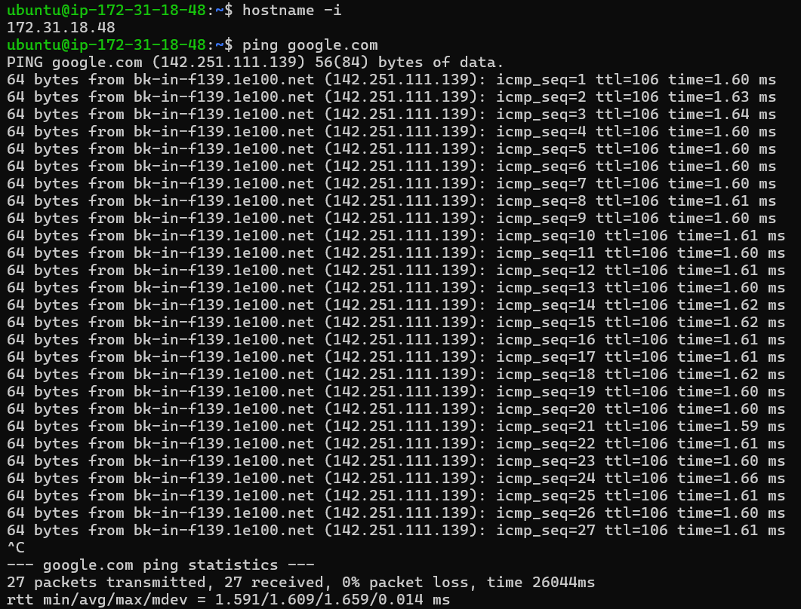
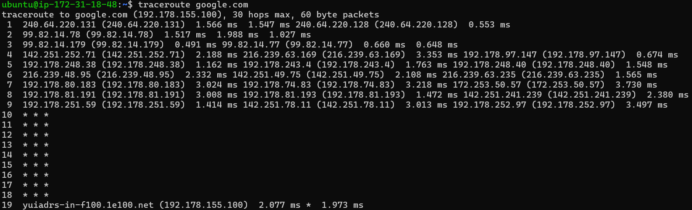
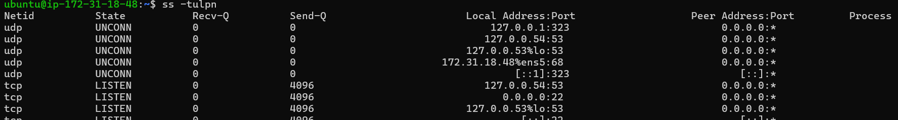
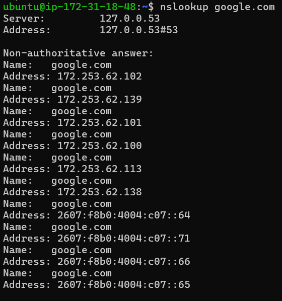
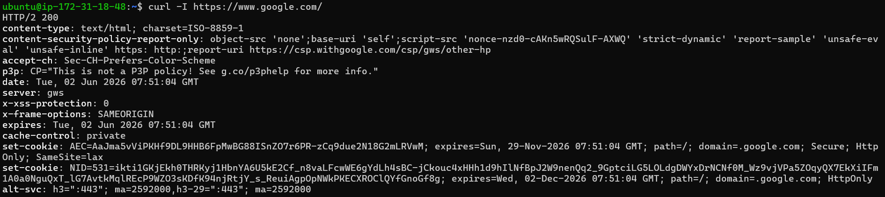
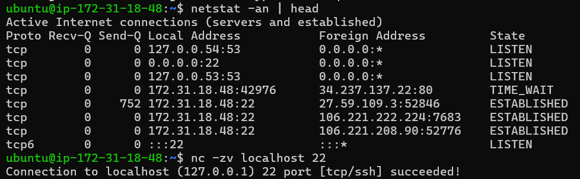

# Day 14 – Networking Fundamentals & Hands-on Checks

## Quick Concepts

### OSI Model vs TCP/IP Model

#### OSI Model (L1–L7)

* Physical, Data Link, Network, Transport, Session, Presentation, and Application layers.
* Provides a detailed view of how data moves across a network.

#### TCP/IP Model

* Link, Internet, Transport, and Application layers.
* Practical model used by modern networks and the Internet.

### Where Common Protocols Sit

| Protocol | Layer                    |
| -------- | ------------------------ |
| IP       | Internet / Network Layer |
| TCP      | Transport Layer          |
| UDP      | Transport Layer          |
| DNS      | Application Layer        |
| HTTP     | Application Layer        |
| HTTPS    | Application Layer        |

### Real Example

`curl https://example.com`

Application Layer (HTTPS) → Transport Layer (TCP) → Internet Layer (IP) → Link Layer (Ethernet/Wi-Fi)

---

## Hands-on Checklist

### 1. Identity Check

**Result:**

* IP Address: `172.31.18.48`

**Observation:**

* The system has a private IP address within the 172.31.x.x range.
* The instance is operating inside a private cloud network.

---

### 2. Reachability Test

**Target:** `google.com`

**Result:**

* Packets Transmitted: 27
* Packets Received: 27
* Packet Loss: 0%
* Average Latency: 1.609 ms

**Observation:**

* The target was reachable with no packet loss.
* Network latency was very low and stable.

---

### 3. Path Discovery

**Target:** `google.com`

**Result:**

* Traffic passed through AWS network infrastructure before entering Google's network.
* Several intermediate hops did not respond to traceroute requests.
* Destination was successfully reached.

**Observation:**

* Hidden hops are common because some routers do not respond to traceroute probes.
* No significant latency spikes were observed.

---

### 4. Listening Ports

**Result:**

* SSH listening on port `22`
* Local DNS resolver listening on port `53`

**Observation:**

* SSH is available for remote administration.
* Local DNS services are active for hostname resolution.

---

### 5. DNS Resolution

**Command Result:**

* `google.com` resolved successfully.
* Multiple IPv4 and IPv6 addresses were returned.

**Observation:**

* DNS resolution is functioning correctly.
* Google uses multiple IP addresses for load balancing and availability.

---

### 6. HTTP Check

**Target:** `https://www.google.com`

**Result:**

* HTTP Status Code: `200 OK`
* Protocol: `HTTP/2`

**Observation:**

* DNS resolution, TCP connectivity, TLS negotiation, and web server response all worked successfully.

---

### 7. Connections Snapshot

**Result:**

* Multiple LISTEN sockets observed.
* Multiple ESTABLISHED SSH sessions observed.
* One TCP connection in TIME_WAIT state observed.

**Observation:**

* Active remote administration sessions were present.
* The system had active network activity at the time of inspection.

---

## Mini Task: Port Probe & Interpret

### Selected Service

* SSH (Port 22)

### Test Result

Connection to `localhost:22` succeeded.

### Interpretation

* Port 22 was reachable from the local machine.
* The SSH service was running and accepting TCP connections.

### If It Had Failed

Next checks would include:

1. Verify the SSH service status.
2. Verify firewall/security-group rules.
3. Confirm the service is listening on the expected port.

---

## Reflection

### Which command gives the fastest signal when something is broken?

`ping` provides the fastest basic connectivity check because it immediately shows whether the target is reachable and reports latency and packet loss.

### What layer would you inspect next if DNS fails?

I would verify IP connectivity at the Internet/Network layer first, because DNS depends on underlying network connectivity to function.

### What layer would you inspect if HTTP 500 appears?

The Application Layer. An HTTP 500 error indicates that the request reached the server successfully, but the application or backend service encountered an internal error.

### Two follow-up checks during a real incident

1. Check service status to confirm the application is running.
2. Review application and system logs to identify the root cause of the failure.

---

## Summary

This exercise demonstrated basic network troubleshooting on an AWS EC2 instance. Connectivity, routing, DNS resolution, HTTP access, active services, and local port reachability were successfully verified using standard Linux networking tools.

