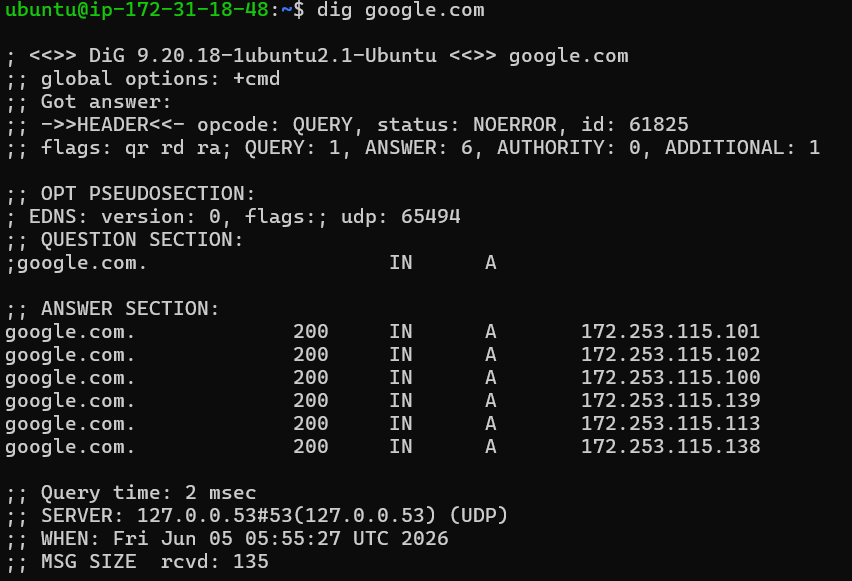
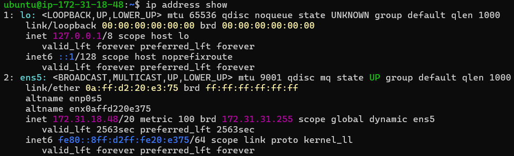
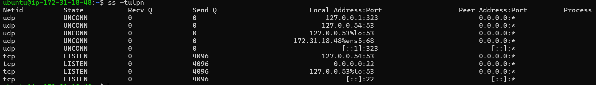

# Day 15 - Networking Concepts

## Task 1: DNS – How Names Become IPs

### What happens when you type google.com in a browser?

When I type google.com in a browser, the system first queries DNS to find the IP address associated with the domain name. DNS returns the IP address, and then the browser connects to Google's server using that IP address. After the connection is established, the website content is loaded.

### DNS Record Types

* **A Record**: Maps a domain name to an IPv4 address.
* **AAAA Record**: Maps a domain name to an IPv6 address.
* **CNAME Record**: Maps one domain name to another domain name (alias).
* **MX Record**: Specifies the mail server responsible for receiving emails for a domain.
* **NS Record**: Specifies the authoritative DNS servers for a domain.

### dig google.com Output



* TTL: 101 seconds
* A Record Example: 172.253.62.100

---

## Task 2: IP Addressing

### What is an IPv4 Address?

IPv4 is a 32-bit addressing system used to identify devices on a network and enable communication between them.

### Structure

Example:

```text
192.168.1.10
```

An IPv4 address contains 4 octets separated by dots. Each octet ranges from 0 to 255.

### Public vs Private IP

* Public IP Example: 8.8.8.8
* Private IP Example: 172.31.18.48

### Private IP Ranges

```text
10.0.0.0 - 10.255.255.255
172.16.0.0 - 172.31.255.255
192.168.0.0 - 192.168.255.255
```

### ip addr show Output



The IP address 172.31.18.48 is a private IPv4 address because it belongs to the range 172.16.0.0 - 172.31.255.255.

---

## Task 3: CIDR & Subnetting

### What does /24 mean?

In 192.168.1.0/24, the first 24 bits represent the network portion and the remaining 8 bits represent host addresses.

### Usable Hosts

* /24 = 254 usable hosts
* /16 = 65,534 usable hosts
* /28 = 14 usable hosts

### Why Do We Subnet?

Subnetting helps organize networks efficiently, reduce IP wastage, improve security, and simplify network management.

### CIDR Table

| CIDR | Subnet Mask     | Total IPs | Usable Hosts |
| ---- | --------------- | --------- | ------------ |
| /24  | 255.255.255.0   | 256       | 254          |
| /16  | 255.255.0.0     | 65,536    | 65,534       |
| /28  | 255.255.255.240 | 16        | 14           |

---

## Task 4: Ports – The Doors to Services

### What is a Port?

A port identifies a specific service or application running on a device. It allows multiple services to use the same IP address.

### Common Ports

| Port  | Service |
| ----- | ------- |
| 22    | SSH     |
| 80    | HTTP    |
| 443   | HTTPS   |
| 53    | DNS     |
| 3306  | MySQL   |
| 6379  | Redis   |
| 27017 | MongoDB |

### ss -tulpn Output



Port 22 is used by SSH. The service is listening on both IPv4 and IPv6 interfaces.

---

## Task 5: Putting It Together

### You run curl http://myapp.com:8080 — what networking concepts are involved?

DNS first resolves myapp.com into an IP address. The system then connects to that IP address on port 8080 to reach the application service running on the server.

### Your app can't reach a database at 10.0.1.50:3306 — what would you check first?

I would first check whether the database service is running and listening on port 3306. Then I would verify firewall rules, security groups, and network connectivity.

---

## What I Learned

1. I learned how DNS resolves domain names into IP addresses and how DNS records work.
2. I learned the difference between public and private IP addresses and how to identify them.
3. I learned how CIDR, subnetting, and ports are used to organize networks and expose services.

