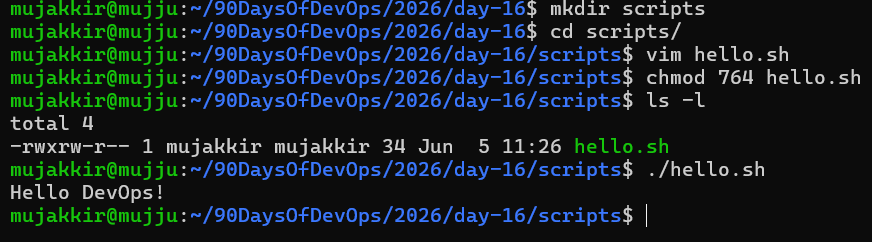
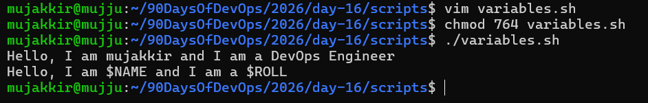
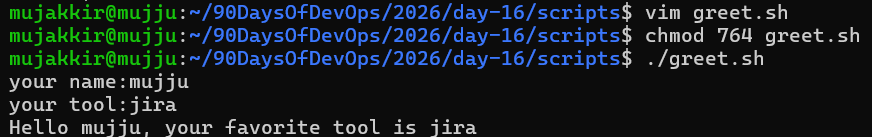
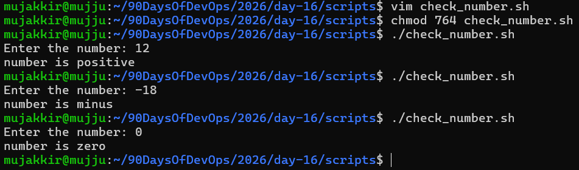
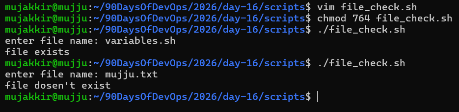
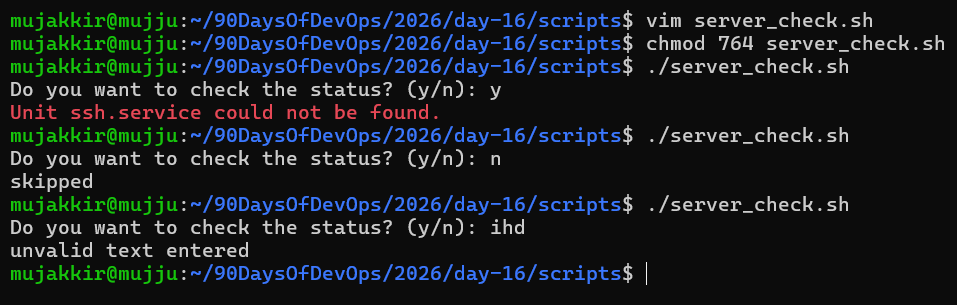

# Day 16 - Shell Scripting Basics

## Overview

Today I learned the fundamentals of Bash scripting, including creating executable scripts, working with variables, taking user input, using conditional statements, and checking system services.

---

## Task 1: Hello World Script

### Script: hello.sh

[Here is the script hello.sh](scripts/hello.sh)

### Output

### Observation

The shebang (`#!/bin/bash`) tells Linux which interpreter should execute the script. Without it, the script may not run correctly when executed directly.

---

## Task 2: Variables

### Script: variables.sh

[Here is the script variables.sh](scripts/variables.sh)

### Output

### Observation

* Double quotes expand variables.
* Single quotes treat variables as plain text.

---

## Task 3: User Input

### Script: greet.sh

[Here is the script greet.sh](scripts/greet.sh)

### Output

---

## Task 4: If-Else Conditions

### Script: check_number.sh

[Here is the script check_number.sh](scripts/check_number.sh)

###  Output

### Script: file_check.sh

[Here is the script file_check.sh](scripts/file_check.sh)

### Output

---

## Task 5: Service Status Checker

### Script: server_check.sh

[Here is the script server_check.sh](scripts/server_check.sh)

### Output

## Key Learnings

1. Bash scripts automate repetitive tasks and can be executed like programs using executable permissions.
2. Variables and user input make scripts dynamic and reusable.
3. Conditional statements (`if`, `elif`, `else`) allow scripts to make decisions based on user input or system state.

---

## Skills Practiced

* Bash Scripting
* Linux Commands
* File Permissions
* Variables
* User Input Handling
* Conditional Statements
* Service Monitoring Basics

