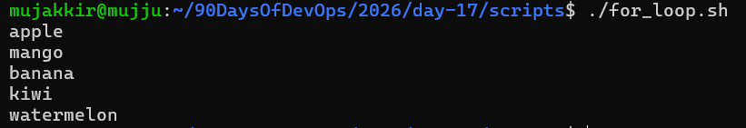
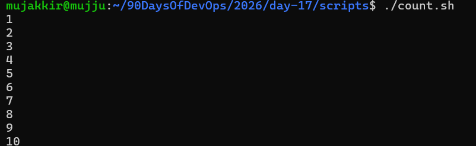
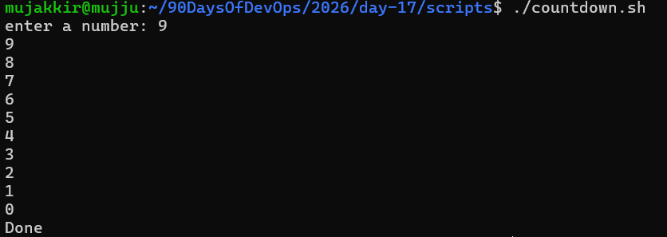
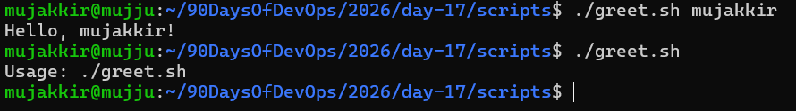
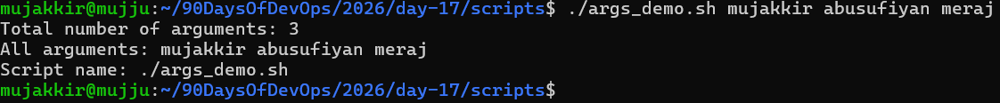
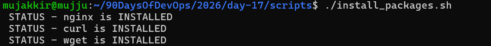
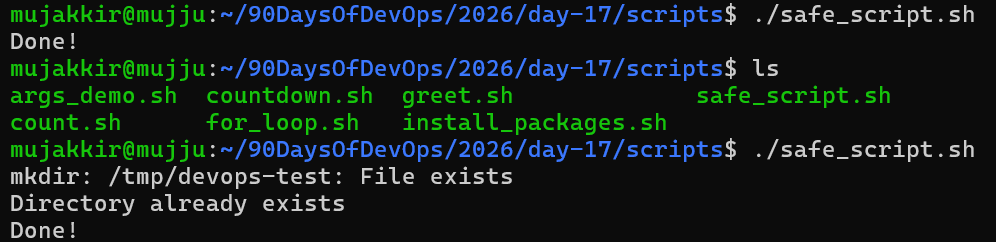
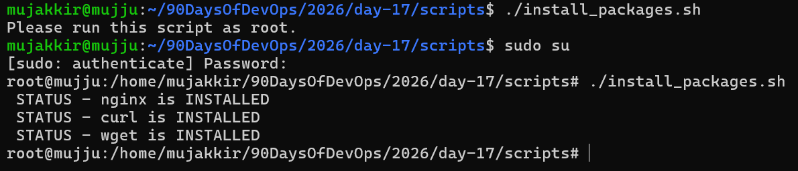

# Day 17 - Shell Scripting

## Task 1: For Loop

### for_loop.sh

[Here is the script for_loop.sh](scripts/for_loop.sh)i
 

### count.sh

[Here is the script count.sh](scripts/count.sh)

---

## Task 2: While Loop

### countdown.sh

[Here is the script countdown.sh](scripts/countdown.sh)

---

## Task 3: Command-Line Arguments

### greet.sh

[Here is the script greet.sh](scripts/greet.sh)

### args_demo.sh

[Here is the script args_demo.sh](scripts/args_demo.sh)

---

## Task 4: Install Packages via Script

### install_packages.sh

[Here is the script install_packages.sh](scripts/install_packages.sh)

---

## Task 5: Error Handling

### safe_script.sh

[Here is the script safe_script.sh](scripts/safe_script.sh)

---

### Modify your install_packages.sh

[Here is the script modified_install_packages.sh](scripts/modified_install_packages.sh)

# What I Learned

1. How to use `for` loops and `while` loops in Bash scripting.
2. How to use command-line arguments such as `$0`, `$1`, `$@`, and `$#`.
3. How to automate package installation and handle errors using `set -e`, `&&`, and `||`.

