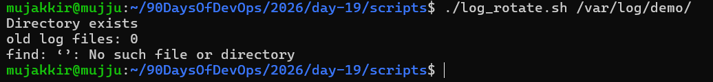
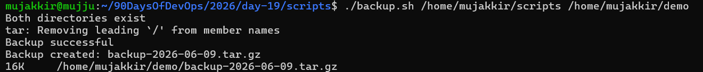
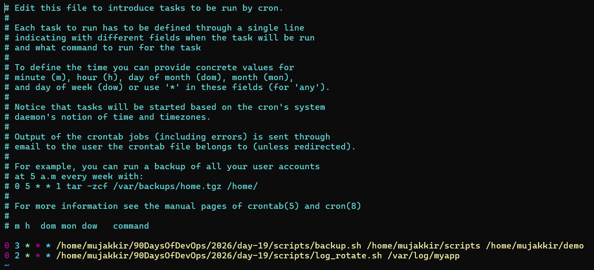
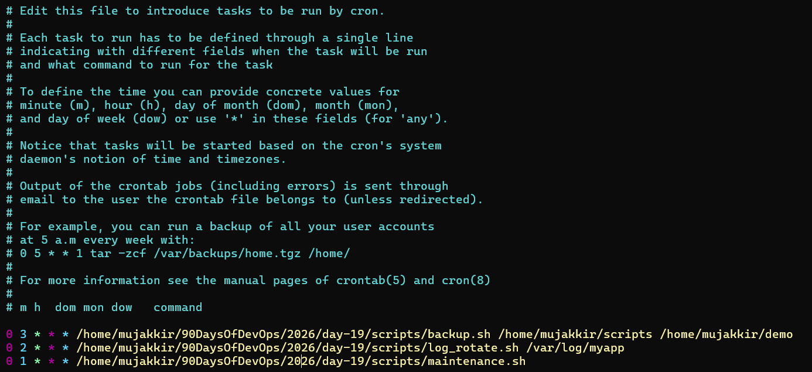

# Day 19 Project – Shell Scripting: Log Rotation, Backup & Automation

Today I worked on a real-world DevOps mini project where I combined **Shell Scripting**, **Automation**, and **Cron Jobs**.

This project helped me understand how Linux systems handle logs, backups, and scheduled maintenance in production environments.

---

# 1. Log Rotation Script (`log_rotate.sh`)

## Purpose

* Compress `.log` files older than 7 days
* Delete `.gz` files older than 30 days
* Print the number of files processed

## Script

[here is the script log_rotate.sh](scripts/log_rotate.sh)

## Output

---

# 2. Backup Script (`backup.sh`)

## Purpose

* Create timestamped backups
* Verify backup success
* Show backup file size
* Clean up old backups

## Script

[Here is the script backup.sh](scripts/backup.sh)

## Output

---

# 3. Maintenance Script (`maintenance.sh`)

## Purpose

* Run log rotation and backup together
* Log all operations with timestamps
* Create a centralized maintenance log

## 

---

# ⏰ 4. Cron Jobs (Automation)

## Log Rotation – Daily at 2 AM
## Backup – Daily at 3 AM
## Maintenance – Daily at 1 AM

[Here is the script maintenance.sh](scripts/maintenance.sh)

---

# What I Learned From This Project

### Shell Scripting Basics

* Using variables and command-line arguments
* Writing conditional statements
* Executing Linux commands within scripts
* Handling script exit statuses

### Scheduling with Cron

* Automating repetitive tasks
* Understanding cron syntax
* Running maintenance jobs at scheduled times
* Reducing manual server administration effort

This project helped me connect shell scripting with real DevOps workflows It is not just about writing commands, but about building systems that run automatically, reliably, and with minimal manual intervention.

Through this project, I gained hands-on experience with Linux automation, backup strategies, log management, and scheduled maintenance—skills that are commonly used in production environments by DevOps and System Administration teams.

---

