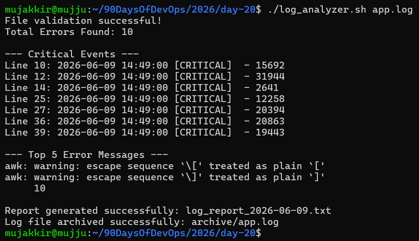

# Day 20 – Bash Scripting Challenge: Log Analyzer and Report Generator

## 📌 Objective

Build a Bash script that automates log analysis by:

* Validating input log files
* Counting errors
* Identifying critical events
* Finding the most common error messages
* Generating a summary report
* Archiving processed logs

---

# Script: `log_analyzer.sh`
[ here is your log_analyzer.sh ](log_analyzer.sh)

---

# Sample Output

---

# Commands and Tools Used

| Command    | Purpose                                        |
| ---------- | ---------------------------------------------- |
| `grep`     | Search for ERROR, Failed, and CRITICAL entries |
| `grep -c`  | Count matching log entries                     |
| `grep -n`  | Display matching entries with line numbers     |
| `awk`      | Extract error messages from log lines          |
| `sort`     | Sort extracted messages                        |
| `uniq -c`  | Count occurrences of duplicate messages        |
| `head -5`  | Display the top 5 results                      |
| `wc -l`    | Count total lines in the log file              |
| `mkdir -p` | Create archive directory if it doesn't exist   |
| `mv`       | Move processed logs into archive directory     |
| `date`     | Generate report filenames and timestamps       |

---

# Key Learnings

### 1. Log Analysis with Bash

Learned how to analyze log files using Bash scripting and extract useful operational insights.

### 2. Powerful Linux Text Processing

Used tools like `grep`, `awk`, `sort`, and `uniq` together to process and summarize large log files efficiently.

### 3. Automation and Reporting

Learned how to automate repetitive system administration tasks, generate reports, and archive processed logs for better organization.

---

## Outcome

Successfully built a Bash-based Log Analyzer and Report Generator capable of:

* Validating input files
* Counting errors
* Detecting critical events
* Identifying common issues
* Generating analysis reports
* Archiving processed logs

This project demonstrates practical Bash scripting and Linux text-processing skills commonly used in DevOps and System Administration.

