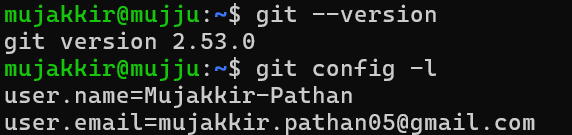
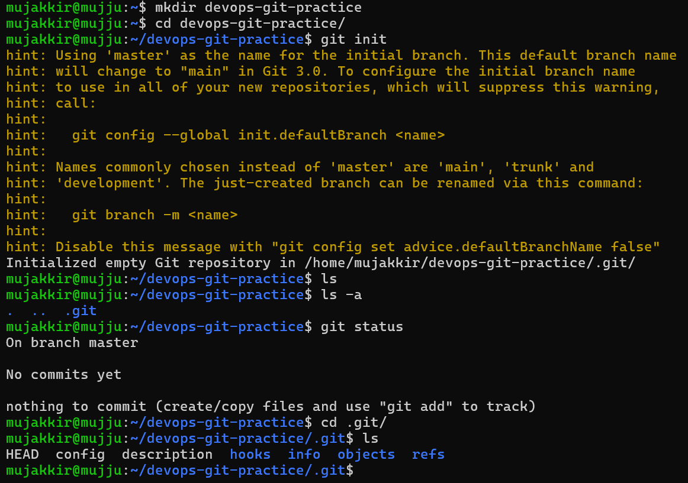
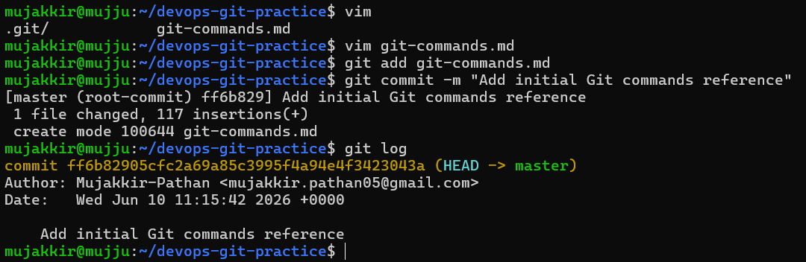
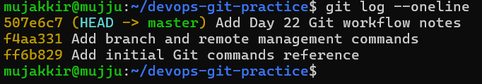

# Day 22 - Introduction to Git

## Task 1: Install and Configure Git

### What I Did

* Verified that Git was installed on my system.
* Checked the installed Git version.
* Verified my Git username and email configuration.

### Screenshot

Add screenshot here:




---

## Task 2: Create Your Git Project

### What I Did

* Created a new directory named `devops-git-practice`.
* Initialized it as a Git repository.
* Explored the hidden `.git` directory.
* Examined the repository status using Git.

### Screenshot

Add screenshot here:




---

## Task 3: Create Your Git Commands Reference

### What I Did

* Created `git-commands.md`.
* Added Git commands under:

  * Setup & Config
  * Basic Workflow
  * Viewing Changes
* Included command descriptions and usage examples.

### file

[here is your git-command.md](git-command.md)

---

## Task 4: Stage and Commit

### What I Did

* Staged the `git-commands.md` file.
* Created my first commit with a meaningful commit message.
* Viewed commit history to verify the commit.

### Commit Message

```text
Add initial Git commands reference
```

### Screenshot

Add screenshot here:




---

## Task 5: Make More Changes and Build History

### What I Did

* Added branch and remote management commands to `git-commands.md`.
* Created additional commits with descriptive messages.
* Created `day-22-notes.md`.
* Built a clean Git commit history with multiple commits.
* Viewed commit history using `git log --oneline`.

### Commit History

```text
507e6c7 Add Day 22 Git workflow notes
f4aa331 Add branch and remote management commands
ff6b829 Add initial Git commands reference
```

### Screenshot

Add screenshot here:



---

## Task 6: Understand the Git Workflow

### What I Did

Created `day-22-notes.md` and answered the following questions:

* Difference between `git add` and `git commit`
* Purpose of the staging area
* Information shown by `git log`
* Purpose of the `.git` directory
* Difference between working directory, staging area, and repository

### Screenshot

Add screenshot here:


---

## Key Learnings

* Git is a distributed version control system.
* The staging area allows selective commits.
* Meaningful commit messages create a clean project history.
* The `.git` directory contains the complete repository metadata and history.
* `git status` is essential for understanding the current state of a repository.

## Files Created

* `git-commands.md`
* `day-22-notes.md`

#90DaysOfDevOps #DevOpsKaJosh #TrainWithShubham

