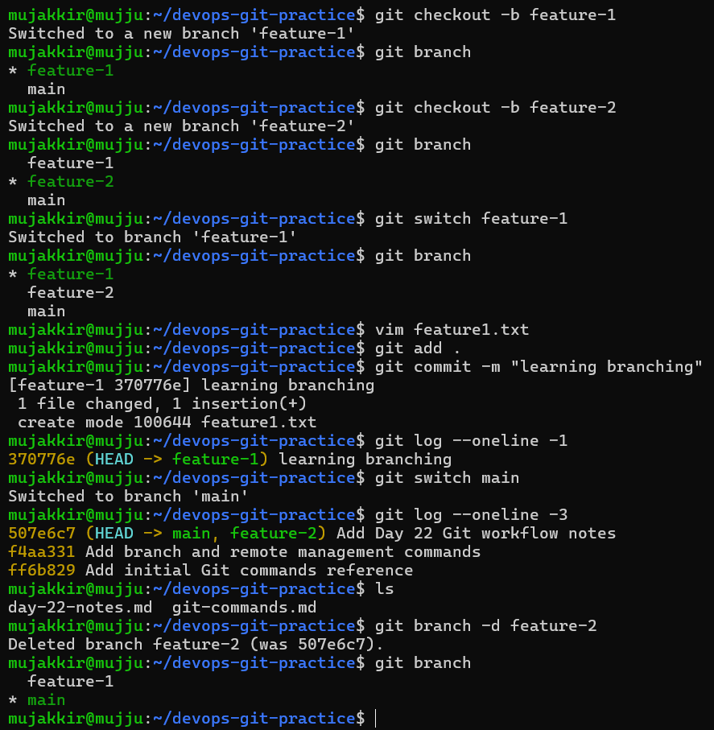
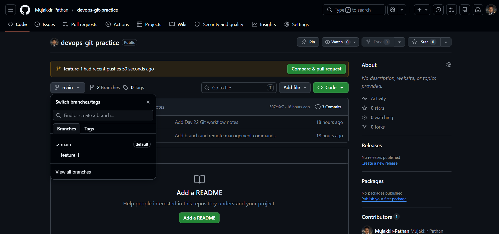
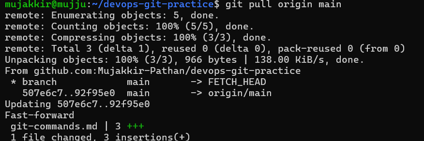
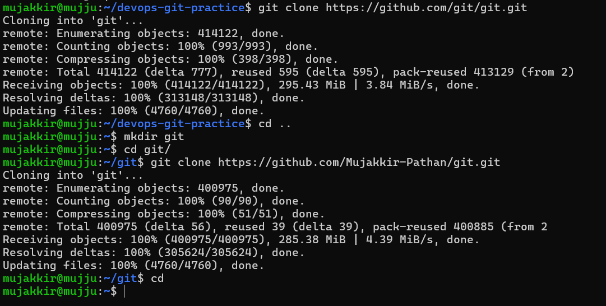

# Day 23 Notes – Git Branching, Remotes, Clone & Fork

## Task 1: Understanding Branches

### What is a branch in Git?

A branch is an independent line of development in a Git repository. It allows developers to work on features, bug fixes, or experiments without affecting the main codebase.

### Why do we use branches instead of committing everything to main?

Branches allow us to:

* Develop features independently.
* Avoid breaking stable code in main.
* Collaborate with multiple developers safely.
* Test changes before merging them into main.

### What is HEAD in Git?

HEAD is a pointer that refers to the current commit and branch you are working on.

### What happens to your files when you switch branches?

When switching branches, Git updates the working directory to match the selected branch. Files that exist only in another branch disappear, and files committed on the selected branch become visible.

---

## Task 2 

### screenshot

---

## Task 3: Push to GitHub

### What is the difference between origin and upstream?

**origin**

* The remote repository associated with your local repository.
* Usually points to your own GitHub repository.

**upstream**

* The original repository from which a fork was created.
* Used to keep your fork synchronized with the source project.

Example:

Original Repository (upstream)
↓
Your Fork (origin)
↓
Local Repository

###screenshot

---

## Task 4: Pull from GitHub

### What is the difference between git fetch and git pull?

**git fetch**

* Downloads changes from the remote repository.
* Does not modify the current branch.
* Lets you inspect changes before merging.

**git pull**

* Downloads changes and merges them into the current branch.
* Updates the working directory immediately.
* Equivalent to fetch + merge.

### screenshot

---

## Task 5: Clone vs Fork

### What is the difference between clone and fork?

**Clone**

* Creates a local copy of a repository on your machine.
* Git operation.

**Fork**

* Creates a copy of a repository under your GitHub account.
* GitHub feature, not a Git feature.

### When would you clone vs fork?

Use **clone** when:

* You have direct access to the repository.
* You want to work locally on a project.

Use **fork** when:

* Contributing to someone else's repository.
* You do not have write access to the original repository.

### After forking, how do you keep your fork in sync with the original repository?

1. Add the original repository as the upstream remote.
2. Fetch updates from upstream.
3. Merge or rebase the changes into your local branch.
4. Push the updated branch to your fork.

This keeps the fork synchronized with the latest changes from the original project.

###screenshot

