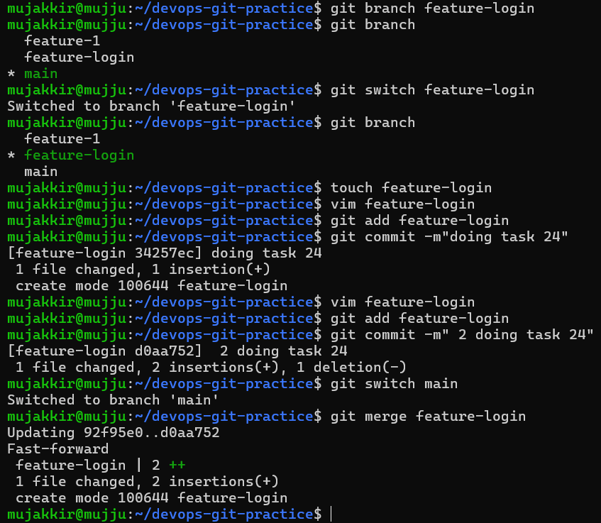
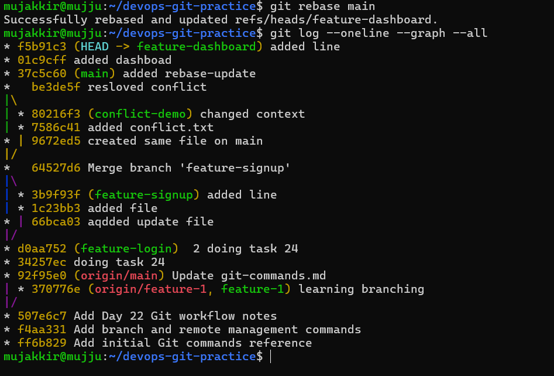
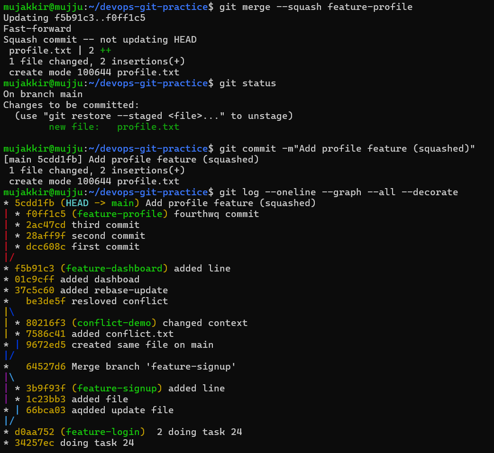
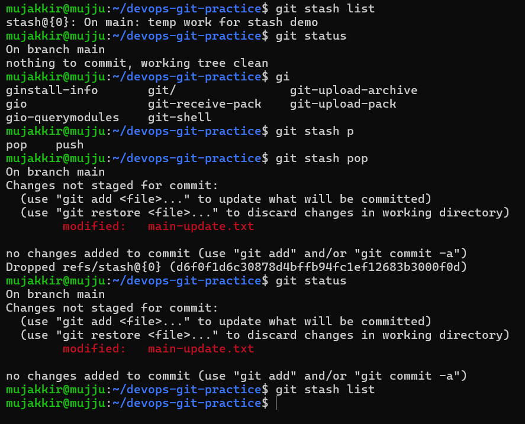

# Day 24 – Git Advanced Concepts (Merge, Rebase, Squash, Stash, Cherry-pick)

## Overview
Today I practiced advanced Git workflows that are commonly used in real DevOps and software engineering teams. The focus was on understanding how Git handles branch integration, history rewriting, and selective commit management.

---

## 1. Git Merge

### Fast-forward Merge
- Happens when the target branch has no new commits after branching.
- Git simply moves the branch pointer forward.
- No merge commit is created.

### Merge Commit
- Created when both branches have diverged.
- Git combines histories and creates a new merge commit.

### Merge Conflict
- Occurs when the same file/line is modified in both branches.
- Git cannot auto-merge and requires manual resolution.

---

## 2. Git Rebase

### What is Rebase?
- Moves or "replays" commits from one branch onto another base commit.
- Creates a linear project history.

### Key Differences vs Merge
- Merge preserves history; rebase rewrites history.
- Rebase produces cleaner, linear logs.

### Important Rule
- Never rebase commits that are already pushed/shared with others.

### When to use Rebase
- Before merging feature branches
- To maintain clean commit history

---

## 3. Squash Merge vs Regular Merge

### Squash Merge
- Combines multiple commits into one single commit.
- Keeps main branch history clean.

### Regular Merge
- Preserves all individual commits.
- Shows full development history.

### Trade-off
- Squash = clean history but loses commit granularity
- Merge = full history but more cluttered log

---

## 4. Git Stash

### What is Stash?
- Temporarily saves uncommitted changes.

### Commands
- `git stash push -m "message"` → save changes
- `git stash apply` → restore changes (keeps stash)
- `git stash pop` → restore and remove stash

### Key Difference
- apply = keeps stash
- pop = removes stash

### Real-world use case
- Switching branches quickly without committing incomplete work

---

## 5. Git Cherry-pick

### What is Cherry-pick?
- Applies a specific commit from one branch to another.

### Use Case
- Apply bug fix from another branch
- Backport specific commits to release branch

### Risk
- Can cause duplicate commits or conflicts

---

## Key Learnings

- Git has multiple ways to integrate branches depending on workflow needs.
- Rebase creates clean history but should be used carefully.
- Squash merge is useful for maintaining clean main branches.
- Stash helps manage temporary work efficiently.
- Cherry-pick allows precise commit selection.

---

## Commands Practiced

- git merge
- git rebase
- git stash (push / apply / pop)
- git cherry-pick
- git log --graph --oneline
- git conflict resolution
