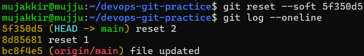
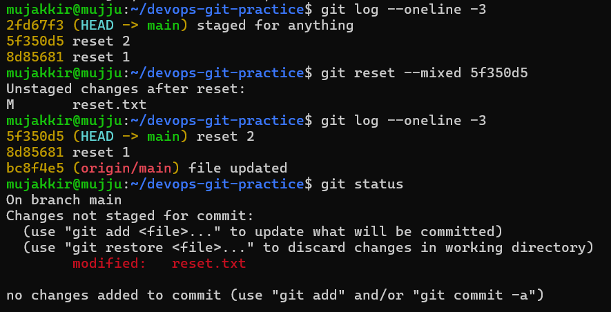
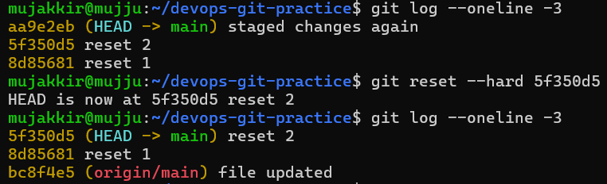
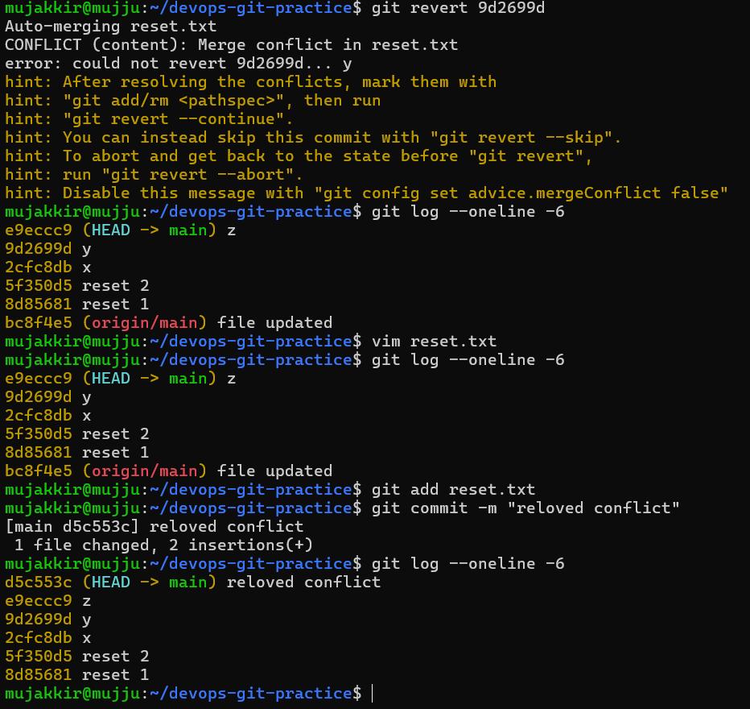

# Day 25 - Git Reset, Git Revert & Branching Strategies

## Overview

Today I learned how to undo changes in Git using `git reset` and `git revert`. I also explored different Git branching strategies used in real-world projects and understood when each approach is appropriate.

---

# Task 1: Git Reset

## Objective

Understand the difference between `--soft`, `--mixed`, and `--hard` reset modes.

### Soft Reset

A soft reset moves the HEAD pointer back to a previous commit while keeping all changes staged.

**Observed Behavior:**

* Commit removed from history
* Changes preserved
* Changes remain staged



### Mixed Reset

A mixed reset moves the HEAD pointer back and unstages the changes.

**Observed Behavior:**

* Commit removed from history
* Changes preserved
* Changes become unstaged




### Hard Reset

A hard reset moves the HEAD pointer back and discards all changes.

**Observed Behavior:**

* Commit removed from history
* Changes deleted from working directory
* Working tree becomes clean



---

## Reset Comparison

| Reset Type | Commit History | Staging Area         | Working Directory |
| ---------- | -------------- | -------------------- | ----------------- |
| `--soft`   | Moves back     | Keeps staged changes | Keeps changes     |
| `--mixed`  | Moves back     | Unstages changes     | Keeps changes     |
| `--hard`   | Moves back     | Clears staging area  | Deletes changes   |

---

## Which Reset Is Destructive?

`git reset --hard` is destructive because it permanently removes local changes from the working directory.

---

## When To Use Each Reset Type

### Soft Reset

Use when:

* Modifying the last commit
* Combining multiple commits
* Rewriting commit history locally

### Mixed Reset

Use when:

* Undoing a commit
* Keeping changes for further editing

### Hard Reset

Use when:

* Discarding unwanted local work
* Returning to a known clean state

---

## Should Reset Be Used On Pushed Commits?

Generally, no.

Reset rewrites commit history. If commits have already been pushed and shared with others, resetting can create synchronization issues and force additional recovery work.

---

# Task 2: Git Revert

## Objective

Learn how to safely undo changes without rewriting history.

### What Is Git Revert?

`git revert` creates a new commit that reverses the changes introduced by an earlier commit.

Unlike reset, it does not remove commits from the project history.

---

## Reverting a Middle Commit



---

## Key Observation

The original commit remained in history.

```text
Revert Commit
Z
Y
X
```

This demonstrates that revert preserves history rather than rewriting it.

---

## Reset vs Revert

| Feature                         | git reset     | git revert             |
| ------------------------------- | ------------- | ---------------------- |
| Rewrites history                | Yes           | No                     |
| Creates new commit              | No            | Yes                    |
| Removes old commit from history | Yes           | No                     |
| Safe for shared branches        | No            | Yes                    |
| Best use case                   | Local cleanup | Undoing pushed commits |

---

## Why Is Revert Safer?

Because it preserves commit history.

Other developers can continue working normally without dealing with rewritten history or forced synchronization.

---

# Task 3: Branching Strategies

## GitFlow

### How It Works

GitFlow uses multiple long-lived branches to manage development and releases.

### Main Branches

* main
* develop
* feature/*
* release/*
* hotfix/*

### Workflow

```text
feature/* -> develop -> release/* -> main
                               ^
                               |
                          hotfix/*
```

### Used In

* Enterprise projects
* Large development teams
* Scheduled release environments

### Pros

* Structured workflow
* Controlled releases
* Easy maintenance of multiple versions

### Cons

* Complex branching model
* More management overhead
* Slower release process

---

## GitHub Flow

### How It Works

Developers create feature branches from `main`, open pull requests, review code, and merge back into `main`.

### Workflow

```text
main
 ├── feature-1 -> PR -> main
 └── feature-2 -> PR -> main
```

### Used In

* Startups
* SaaS products
* Continuous deployment teams

### Pros

* Simple
* Fast
* Easy to learn

### Cons

* Less suited for complex release schedules

---

## Trunk-Based Development

### How It Works

Developers work directly on the main branch or use very short-lived feature branches.

### Workflow

```text
Developers
     |
     v
Short-lived branches
     |
     v
   main
```

### Used In

* Modern DevOps teams
* Continuous Integration environments
* High-velocity engineering organizations

### Pros

* Fast integration
* Fewer merge conflicts
* Supports CI/CD

### Cons

* Requires strong automated testing
* Mistakes can impact the main branch quickly

---

# Branching Strategy Recommendations

### For a Startup Shipping Fast

GitHub Flow or Trunk-Based Development

Reason:

* Faster releases
* Simpler workflow
* Better support for continuous deployment

### For a Large Team With Scheduled Releases

GitFlow

Reason:

* Structured release management
* Better coordination across multiple teams
* Supports release and hotfix processes

---

# Key Takeaways

* `git reset` rewrites history and should be used carefully.
* `git revert` safely undoes changes by creating a new commit.
* `git reset --hard` is destructive.
* `git revert` is preferred for shared and pushed branches.
* Different teams use different branching strategies depending on release requirements.
* GitHub Flow and Trunk-Based Development are popular in modern DevOps environments.
* GitFlow remains useful for large teams with planned release cycles.

---

## Bonus Tip

`git reflog` is Git's safety net.

Even after a hard reset, reflog can often help recover lost commits by showing previous HEAD positions and actions performed in the repository.

