# Day 30 – Docker Images & Container Lifecycle

## Objective

Understand the relationship between Docker images and containers, learn image layers and caching, and practice the complete container lifecycle.

---

# Task 1: Docker Images

### Screenshot 1: Docker Images List

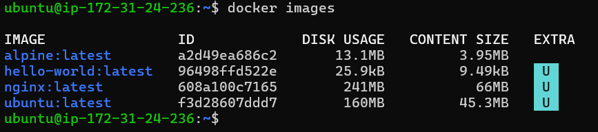

---

## Compare Ubuntu vs Alpine

### Why is Ubuntu much larger than Alpine?

Ubuntu is a full Linux distribution that contains more packages, libraries, and utilities. Alpine is a minimal Linux distribution designed specifically for containers and contains only essential components, making it significantly smaller.

### Screenshot 2: Image Inspection Output

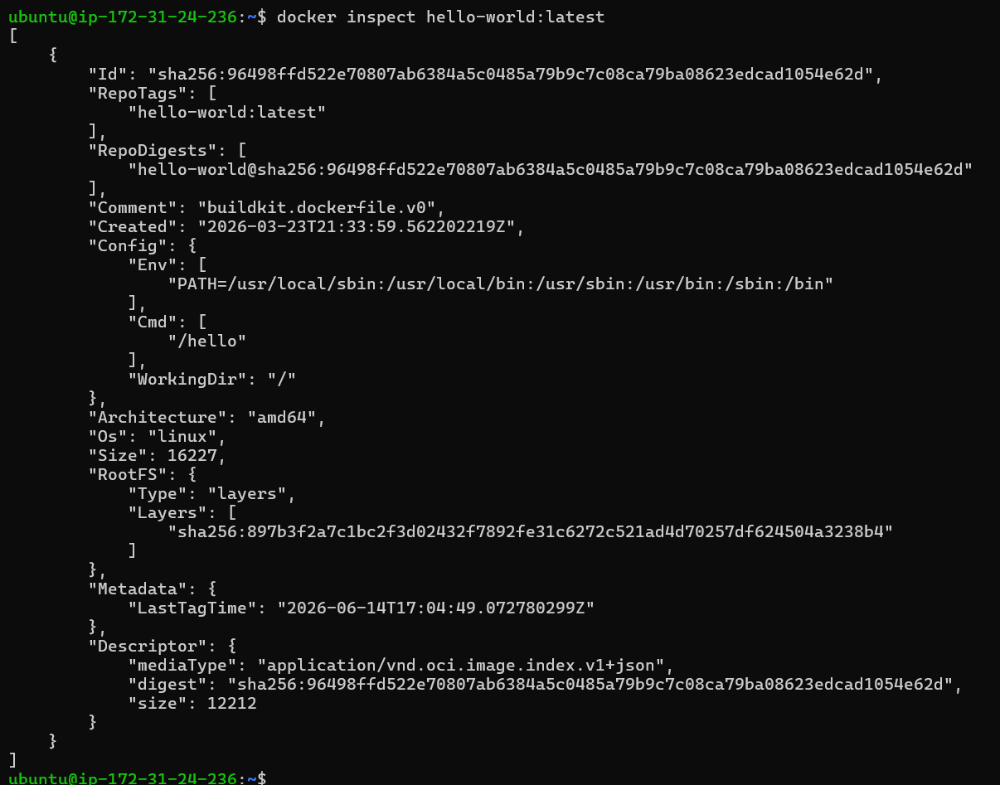

---

## What information can you see from image inspection?

* Image ID
* Creation Date
* Operating System
* Architecture
* Environment Variables
* Default Command
* Filesystem Layers

### Screenshot 3: Image Removal

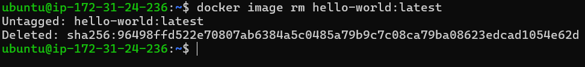

---

# Task 2: Image Layers

### Screenshot 4: Nginx Image History

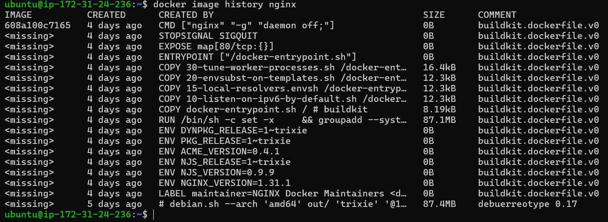

---

## What are layers and why does Docker use them?

Docker layers are read-only filesystem changes stacked together to form an image. Each instruction used during image creation generates a layer.

Docker uses layers to:

* Save storage space
* Reuse existing layers
* Speed up image builds
* Improve caching efficiency
* Reduce download times

### Why do some layers show 0B?

Layers such as ENV, CMD, ENTRYPOINT, LABEL, and EXPOSE only modify metadata and do not change the filesystem, so they appear as 0B.

---

# Task 3: Container Lifecycle

The following lifecycle operations were performed:

### Screenshot 5: Created State

### Screenshot 6: Running State

[Insert Screenshot Here]

### Screenshot 7: Paused State

[Insert Screenshot Here]

### Screenshot 8: Exited State

[Insert Screenshot Here]

### Screenshot 9: Removed Container

[Insert Screenshot Here]

---

## Observed Container States

Created → Running → Paused → Running → Exited → Running → Exited → Removed

---

# Task 4: Working with Running Containers

### Screenshot 10: Nginx Running in Detached Mode

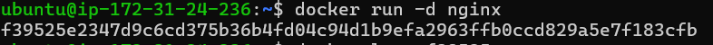

### Screenshot 11: Container Logs

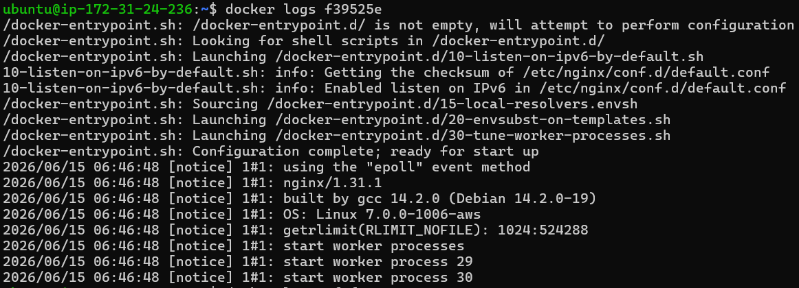
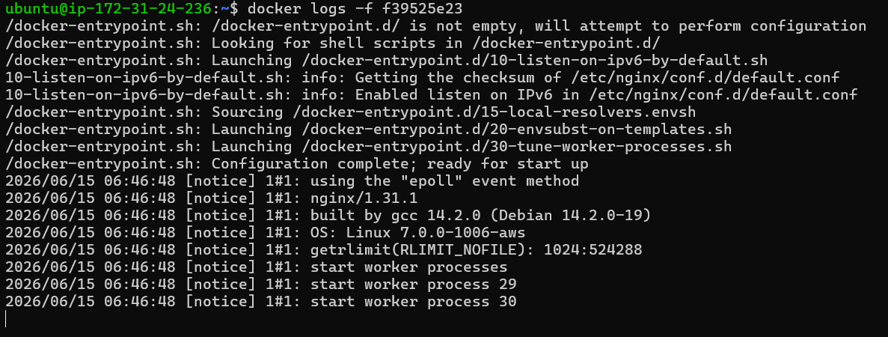

### Screenshot 12: Container Filesystem

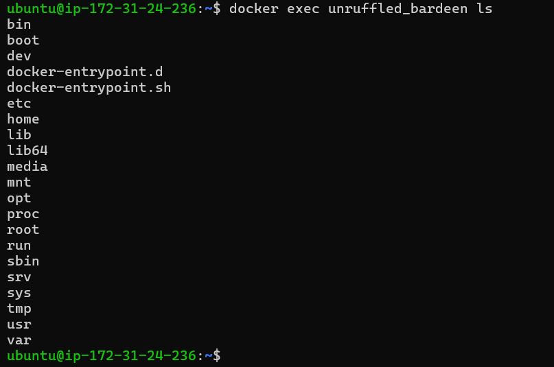

### Screenshot 13: Single Command Execution Inside Container

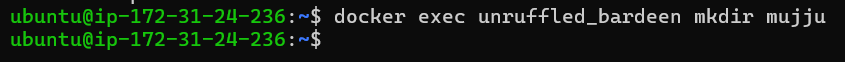

### Screenshot 14: Container Inspection

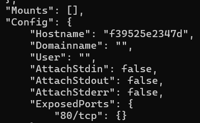
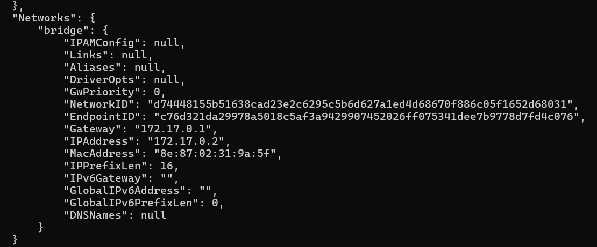

---

## Container Inspection Findings

### IP Address

172.17.0.2

### Port Mapping

80/tcp exposed inside the container.

No host port mapping was configured.

### Mounts

No mounts were attached to the container.

---

# Task 5: Cleanup

### Screenshot 15: Docker Cleanup Activities

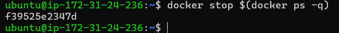
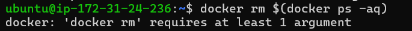
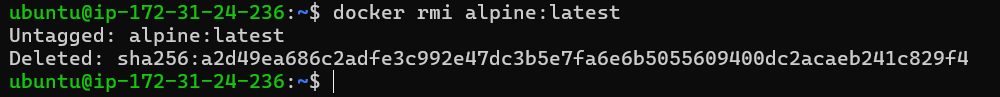

### Screenshot 16: Docker Disk Usage

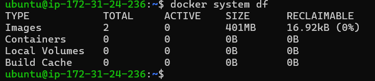

---
# Conclusion

Today I learned how Docker images and containers work, explored image layers and caching, practiced the complete container lifecycle, worked with running containers, inspected container details, and performed Docker cleanup operations.

