# Day 32 – Docker Volumes & Networking

## Task 1: The Problem

### Objective

Understand what happens to database data when a container is removed without using any persistent storage.

### Steps Performed

* Created a PostgreSQL container without attaching any volume.

* Created a database named `my_database`.

* Verified that the database existed.

* Stopped and removed the container.

* Started a new PostgreSQL container from the same image.

* Checked for the database again.
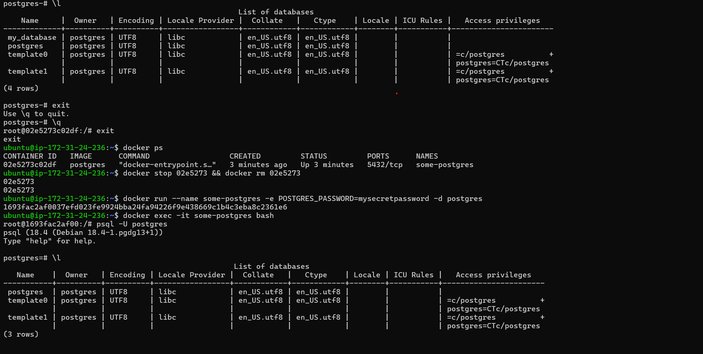

### Observation

The database `my_database` was no longer present after creating the new container.

### Result

Data stored inside a container is lost when the container is removed because it exists only in the container's writable layer.

### Learning

Containers are ephemeral and should not be used for persistent data storage.

---

## Task 2: Named Volumes

### Objective

Use Docker named volumes to persist database data across container recreation.

### Steps Performed

* Created a named volume called `important`.


* Started a PostgreSQL container using the volume.


* Created a database named `my_database`.
* Created a table named `employees`.
* Inserted sample records.
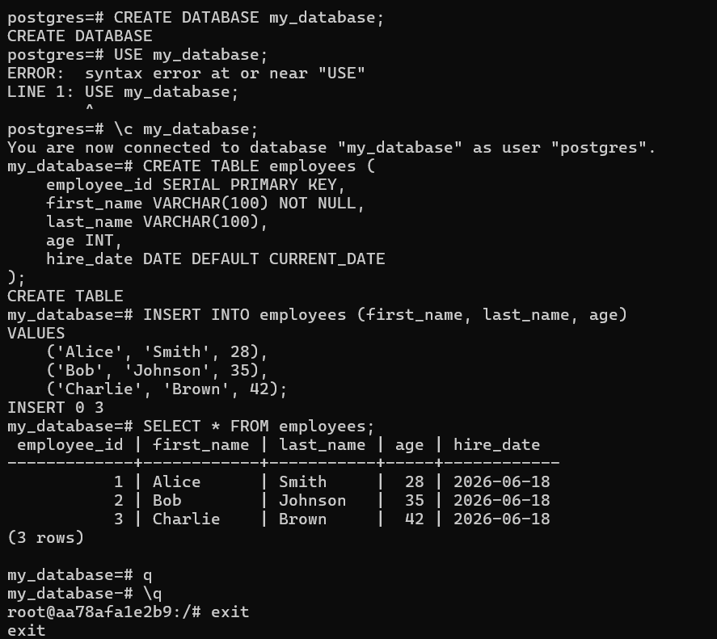

* Stopped and removed the container.
* Started a new PostgreSQL container using the same volume.
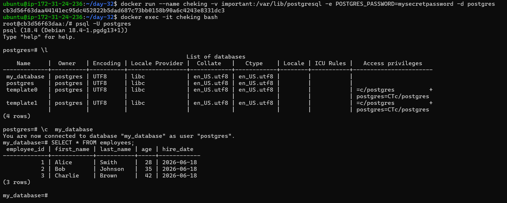

* Verified the database and records.
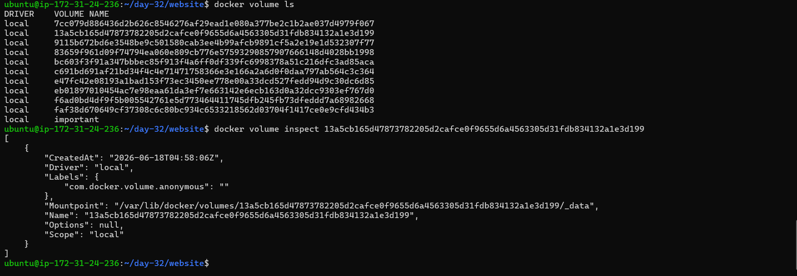

### Observation

The database, table, and records remained available after recreating the container.

### Verification

* Verified volume existence using `docker volume ls`.
* Verified volume details using `docker volume inspect`.

### Result

Named volumes persist data independently of containers.

### Learning

Docker volumes are the recommended approach for storing persistent application data.

---

## Task 3: Bind Mounts

### Objective

Understand how bind mounts connect host directories to containers.

### Steps Performed

* Created a host directory named `website`.
* Added an `index.html` file.
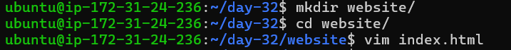

* Started an Nginx container.
* Mounted the host directory to Nginx's web root.
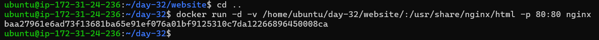

* Accessed the webpage through a browser.


* Modified the `index.html` file on the host.
* Refreshed the browser.
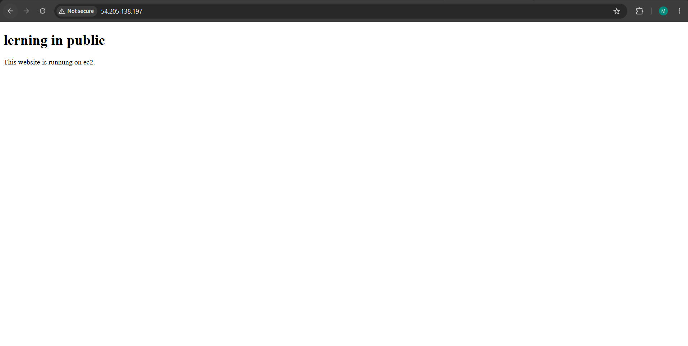

### Observation

Changes made on the host machine were immediately visible inside the container and reflected in the browser.

### Result

Bind mounts provide direct access to host files from containers.

---

## Task 4: Docker Networking Basics

### Objective

Understand communication between containers on the default bridge network.

### Steps Performed

* Listed Docker networks.
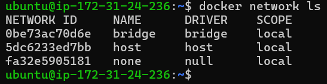

* Inspected the default bridge network.
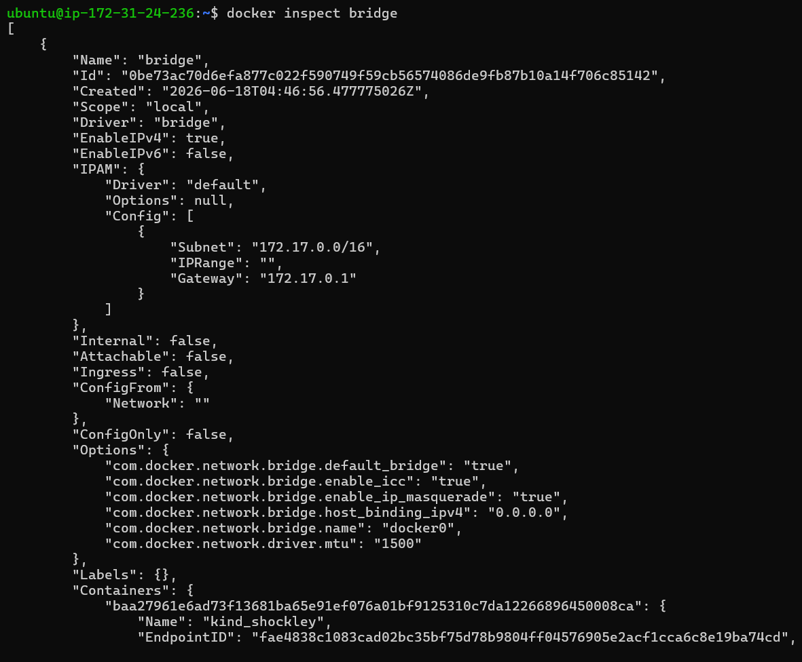

* Tested communication between running containers.
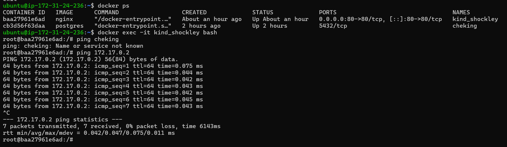


### Observation

#### Ping by Container Name

Failed

#### Ping by IP Address

Successful

### Result

Containers on the default bridge network can communicate using IP addresses but not by container names.

### Learning

The default bridge network does not provide automatic DNS-based name resolution.

---

## Task 5: Custom Networks

### Objective

Understand name-based communication using custom bridge networks.

### Steps Performed

* Created a custom bridge network named `my-app-net`.
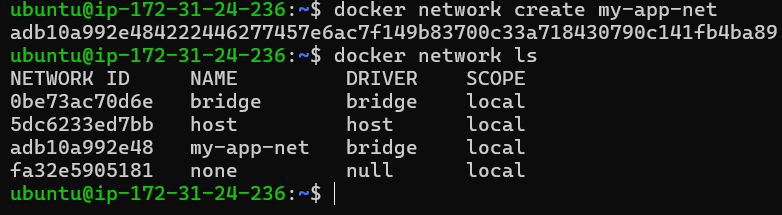

* Started two Ubuntu containers named `app1` and `app2`.
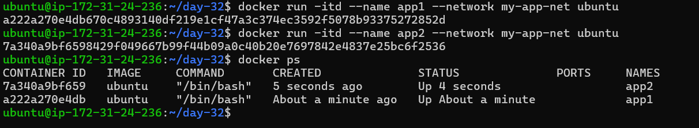

* Attached both containers to the custom network.
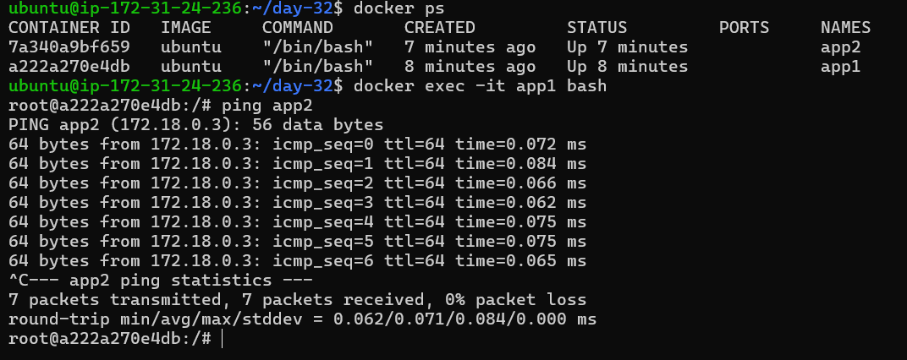

* Tested communication using container names.
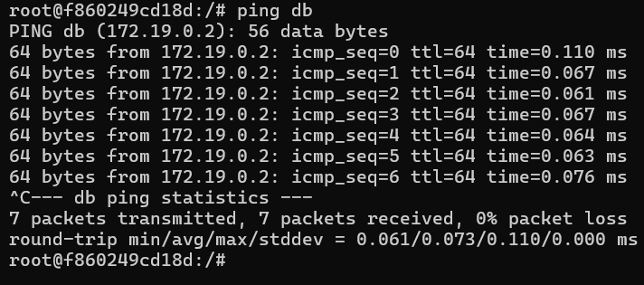


### Observation

`app1` successfully pinged `app2` using its container name.

### Result

Containers on a custom bridge network can communicate using container names.

### Learning

Docker provides an internal DNS service for custom bridge networks, enabling automatic name resolution.

---

## Task 6: Put It Together

### Objective

Combine Docker volumes and custom networking in a multi-container setup.

### Architecture

```text
project-net
│
├── db (PostgreSQL)
│   └── compliance Volume
│
└── app (Ubuntu)
```

### Steps Performed

* Created a custom network named `project-net`.


* Created a named volume named `compliance`.
* Started a PostgreSQL container named `db`.


* Attached the PostgreSQL container to:

  * `project-net`
  * `compliance` volume
* Created a database named `company`.
* Created an `employees` table.
* Inserted employee records.
* Started an Ubuntu container named `app`.
* Attached the Ubuntu container to `project-net`.
* Verified communication from `app` to `db`.

### Sample Data

| Employee ID | First Name | Last Name | Job Title         |
| ----------- | ---------- | --------- | ----------------- |
| 1           | John       | Doe       | Software Engineer |
| 2           | Jane       | Smith     | Data Analyst      |

### Verification

#### Database Data

Successfully retrieved employee records from PostgreSQL.

#### Network Communication

`app` successfully pinged `db` using the container name.

### Result

The application container successfully communicated with the database container through Docker's internal DNS while database data persisted through a named volume.

### Learning

A production-ready containerized application commonly requires:

* Persistent storage using volumes.
* Service-to-service communication using custom networks.
* Container name resolution through Docker DNS.

---

# Key Takeaways

* Containers are ephemeral.
* Volumes provide persistent storage.
* Bind mounts connect host files directly to containers.
* Default bridge networks allow IP-based communication.
* Custom bridge networks provide automatic DNS resolution.
* Combining volumes and custom networks enables real-world multi-container applications.

