# Day 33 – Docker Compose

## Task 1: Install & Verify

* Verified Docker Compose installation.
* Verified Docker Compose version.

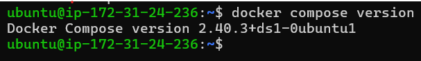 

---

## Task 2: First Compose File

* Created `compose-basics` directory.
* Created `docker-compose.yml`.
* Started Nginx container using Docker Compose.
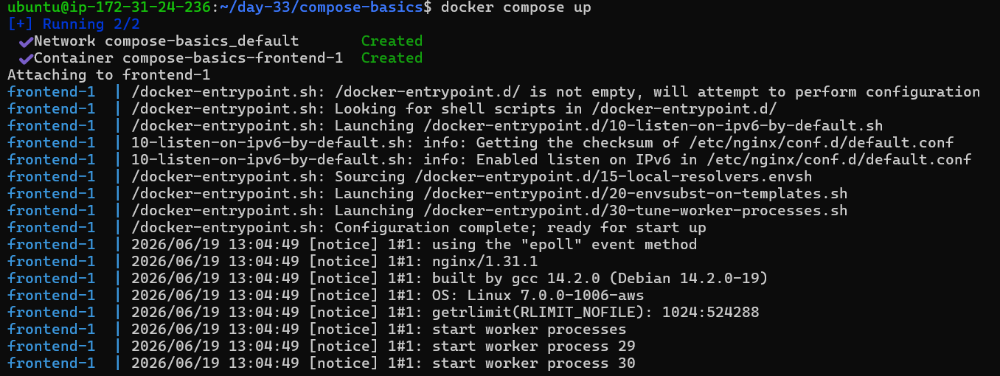
* Accessed Nginx page in browser.
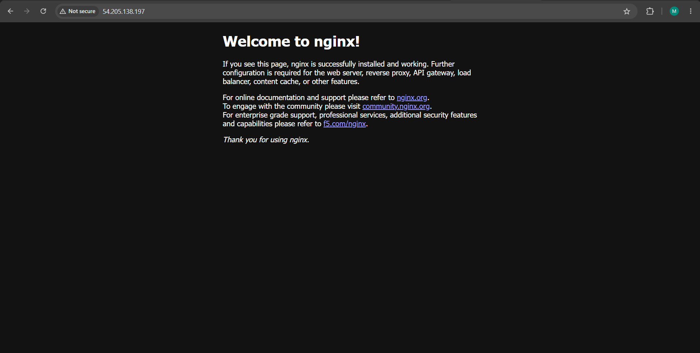 
* Stopped and removed the container. 

---

## Task 3: WordPress + MySQL Setup

### docker-compose.yml

* Created WordPress and MySQL services.
* Configured named volume for MySQL.
* Verified WordPress installation page.
* Completed WordPress setup.
* Verified data persistence after restart.
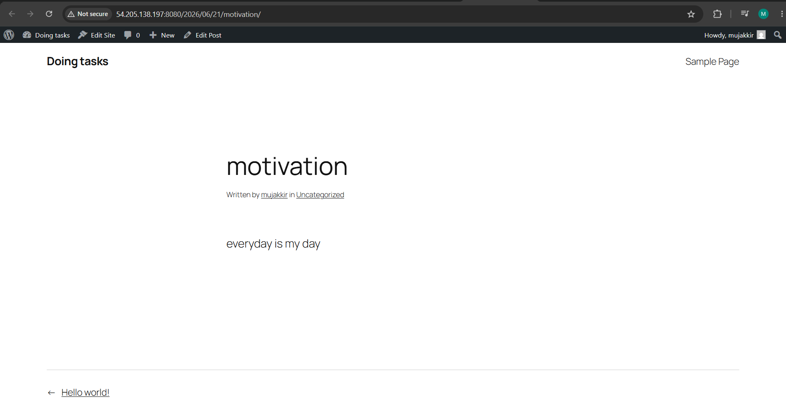 
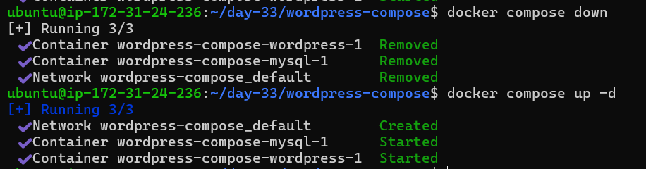 
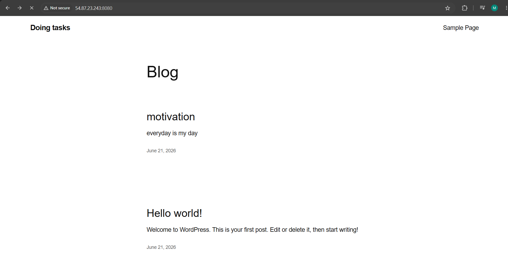 

---

## Task 4: Compose Commands

Practiced the following commands:

* Start services in detached mode
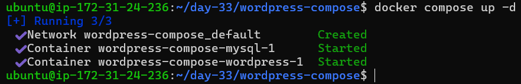 

* View running services
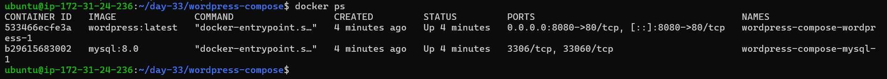 

* View logs of all services
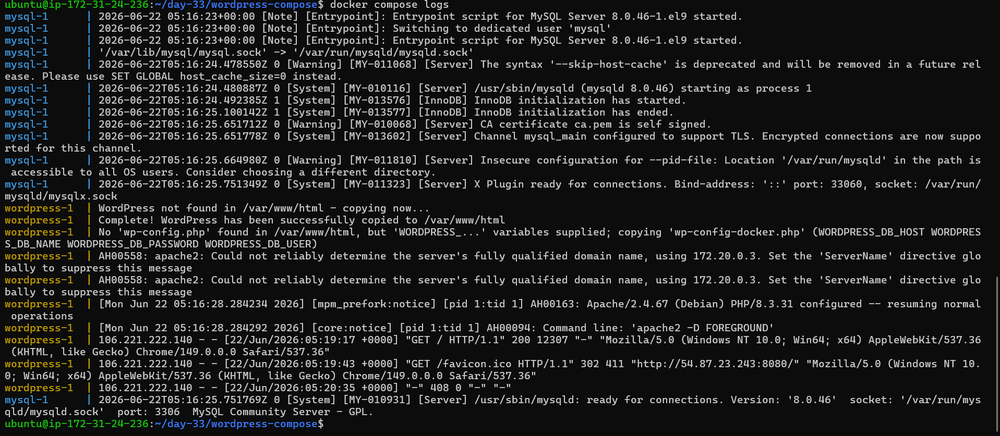

 
* View logs of a specific service
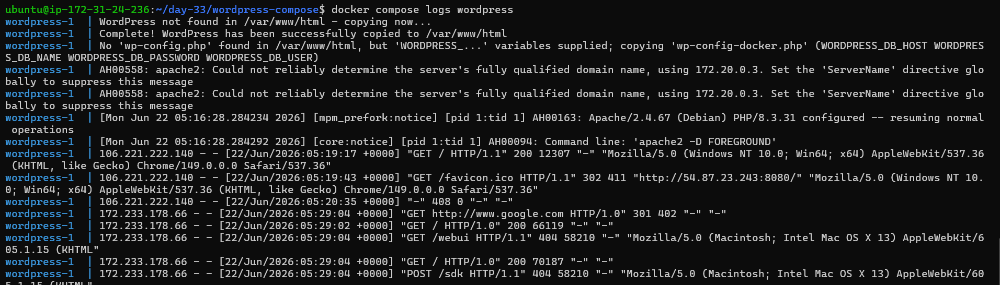 

* Stop services without removing
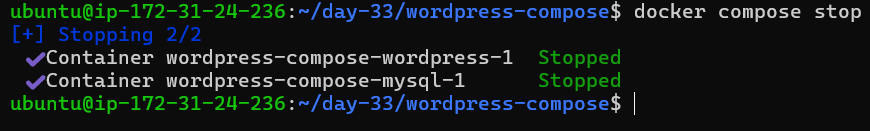 

* Remove containers and networks
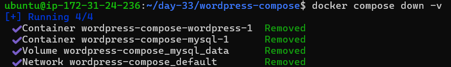 

* Rebuild images
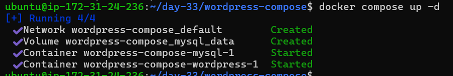 

---

## Task 5: Environment Variables

* Added environment variables directly in `docker-compose.yml`.
* Created `.env` file.
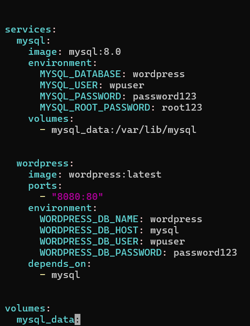

* Referenced variables using `${VARIABLE_NAME}` syntax.
* Verified variables were loaded successfully.
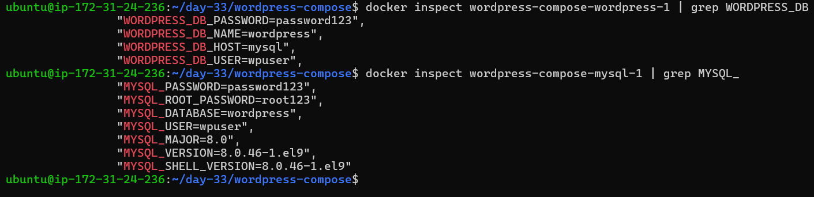

* Website remained accessible after using `.env`.

---

## Outcome

Successfully deployed and managed multi-container applications using Docker Compose.

