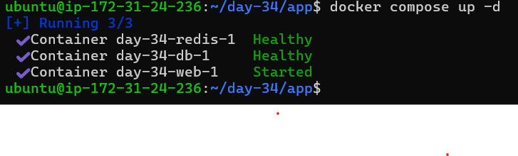
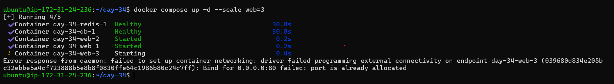

# Day 34 – Docker Compose: Real-World Multi-Container Apps

## 📌 Objective

Today's goal was to build a production-like multi-container application using Docker Compose. The setup included a web application, a database, and a cache service while exploring advanced Docker Compose features such as health checks, restart policies, custom Dockerfiles, networks, volumes, and scaling.

---

# Task 1: Build Your Own App Stack

Created a 3-service application stack: with the help of AI

### Services

* Flask Web Application
* PostgreSQL Database
* Redis Cache

### Docker Compose Features Used

* Custom image build
* Environment variables
* Persistent storage
* Service networking

---

# Task 2: depends_on & Healthchecks

## Database Healthcheck

Implemented PostgreSQL health check:

## Service Dependency

Configured the web application to wait for the database and Redis services:

## Result



---

# Task 3: Restart Policies

Added the following restart policy:

```yaml
restart: always
```

## Testing

Killed the PostgreSQL container manually.

Result:

* Docker automatically restarted the container.

### Comparison

| Policy     | Behavior                                                      |
| ---------- | ------------------------------------------------------------- |
| always     | Restarts on crashes and Docker daemon restarts                |
| on-failure | Restarts only when the container exits with a non-zero status |
| no         | No automatic restart                                          |

### When to Use

#### restart: always

Use for:

* Databases
* Production services
* Critical infrastructure containers

#### restart: on-failure

Use for:

* Batch jobs
* Workers
* Services that should restart only when errors occur

---

# Task 4: Custom Dockerfiles in Compose

Instead of using a prebuilt image, the application was built using:

```yaml
build: ./app
```

## Rebuild After Code Change


This rebuilds the image and recreates containers in a single command.

---

# Task 5: Named Networks & Volumes

## Custom Network

Defined an explicit network:

```yaml
networks:
  app-network:
```

Benefits:

* Better organization
* Improved isolation
* Easier troubleshooting

## Named Volume

Created persistent database storage:

```yaml
volumes:
  db-data:
```

Mounted to:

```text
/var/lib/postgresql/data
```
---

# Task 6: Scaling (Bonus)

Scaled the web service:

## Observed Issue

Docker returned:



## Why It Happens

Each container attempted to bind to the same host port.

Only one container can own host port 80.


---

# 🧠 Key Learnings

* Docker Compose simplifies multi-container application management.
* Health checks ensure services are actually ready before dependent services start.
* `depends_on` with health conditions improves reliability.
* Restart policies improve fault tolerance.
* Custom Dockerfiles provide flexibility during development.
* Named networks improve service organization.
* Volumes ensure data persistence.
* Scaling containers requires load balancing and cannot rely solely on port mappings.

---

# 🏁 Outcome

Successfully built a production-style Docker Compose setup featuring:

---
