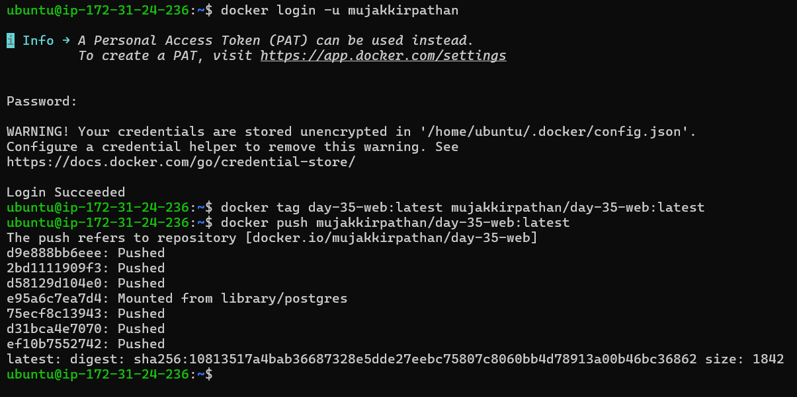
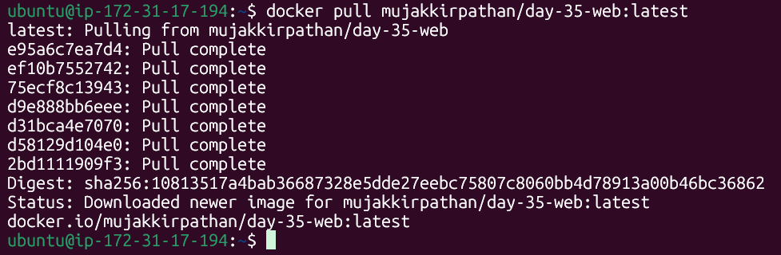
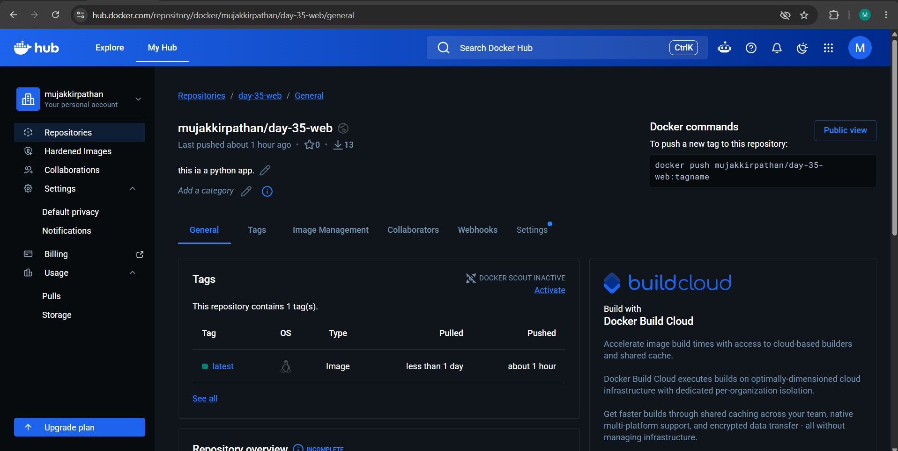

# Day 35 – Multi-Stage Builds & Docker Hub

## Objective

Learn how multi-stage Docker builds help create smaller, cleaner, and more secure container images, and understand how to distribute images using Docker Hub.

---

# Task 1: The Problem with Large Images

I used my Flask application from the previous day and created a single-stage Docker image.

[project folder](ProjectApp/app)

---

# Task 2: Multi-Stage Build

I rewrote the Dockerfile using a multi-stage build.

[Dockerfile](ProjectApp/app/Dockerfile)

### Why is the multi-stage image smaller?

A multi-stage build separates the build environment from the runtime environment. The final image contains only the files required to run the application, while build-related layers remain in the builder stage.

---

# Task 3: Push to Docker Hub

Completed the following:

* Created/used Docker Hub account
* Tagged the image properly
* Pushed the image to Docker Hub
* Verified the image exists in the repository

---

# Task 4: Docker Hub Repository

Verified:

* Repository is visible on Docker Hub
* Repository description added
* Tags are visible
* Understood the difference between specific tags and `latest`

---

# Task 5: Image Best Practices

### Applied Best Practices

Used a minimal runtime image (`alpine:3.22`)

Used specific image tags instead of `latest`

Implemented multi-stage builds

Reduced final image size

Ran application as a non-root user

[project folder](2nd)

[Dockerfile](2nd/Dockerfile)

---

# Outcome

Successfully built optimized Docker images, compared image sizes, pushed images to Docker Hub, and applied container image best practices used in real-world DevOps workflows.

