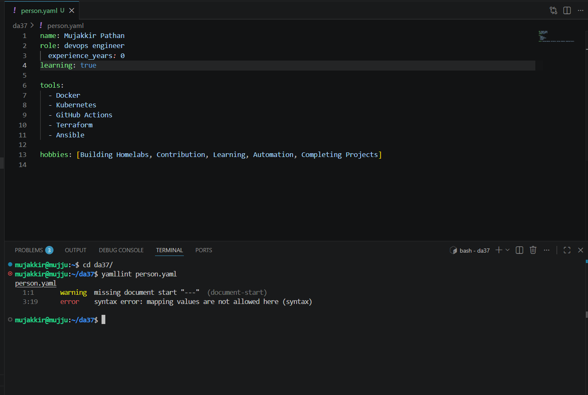
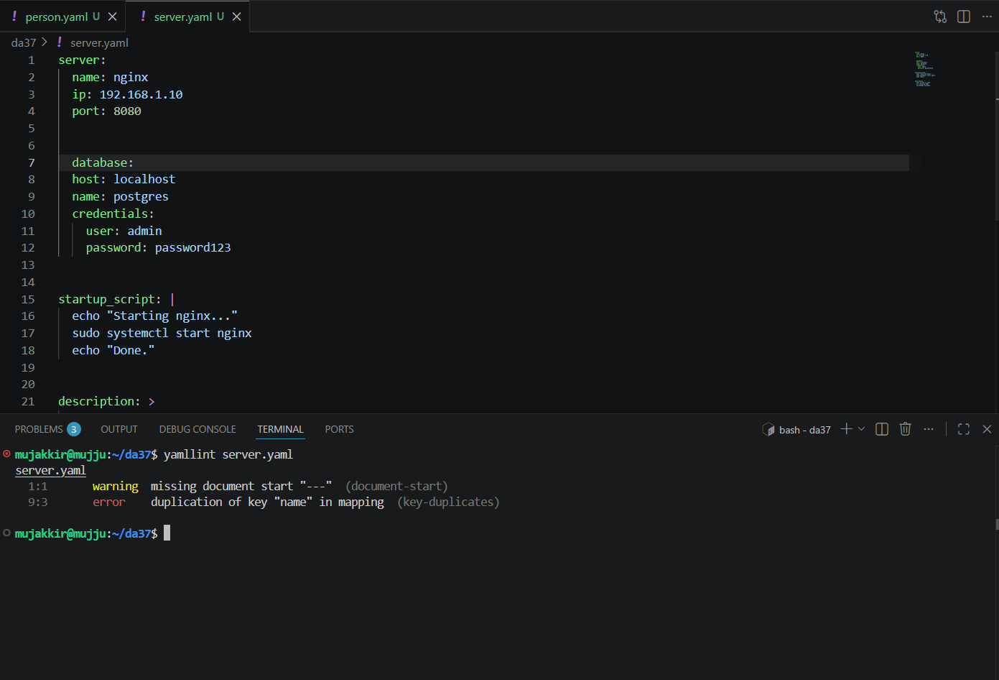

# Day 38 – YAML Basics

## Objective

Learn the fundamentals of YAML by understanding its syntax, creating YAML files, and validating them. This knowledge forms the foundation for writing CI/CD pipelines, Kubernetes manifests, Docker Compose files, and other DevOps configurations.

---

# Task 1 – Key-Value Pairs

Created a `person.yaml` file to describe myself using simple key-value pairs.

[person.yaml](yaml_files/person.yaml)

### Concepts Covered

* Key-value pairs
* Boolean values (`true` / `false`)
* Block lists
* Inline lists

---

# Task 2 – Nested Objects

Created a `server.yaml` file using nested mappings.

[server.yaml](yaml_files/server.yaml)

### Concepts Covered

* Nested objects
* Proper indentation
* Parent-child relationships

---

# Task 3 – Multi-line Strings

Extended `server.yaml` using YAML block styles.

[server.yaml](yaml_files/server.yaml)

```yaml
startup_script: |
  echo "Starting nginx..."
  sudo systemctl start nginx
  echo "Done."

description: >
  This server is used
  for learning YAML
  and DevOps concepts.
```

### Concepts Covered
      
| Block Style | Purpose |
|-------------|---------|
| `|`         | Preserves line breaks exactly as written. Ideal for shell scripts and configuration files. |
| `>`         | Folds multiple lines into a single line. Useful for long descriptions and documentation. |
 
---

# YAML Validation

Validated both YAML files using **yamllint**.

### Validation Results

* Successfully validated both files.
* Observed the warning:

```
missing document start "---"
```

This is a style recommendation, not a syntax error.

### Intentional Error Testing

Introduced an error by duplicating a key.

Example:

```yaml
database:
  name: postgres
  name: mydb
```

Validator output:

```
duplication of key "name" in mapping
```

After removing the duplicate key, the YAML validated successfully.





---

# What I Learned

* YAML relies on **spaces for indentation** and does not allow tabs.
* Lists can be written using **block style** (`- item`) or **inline style** (`[item1, item2]`).
* Nested objects are created through indentation, making YAML clean and easy to read.
* The `|` block preserves line breaks, while the `>` block folds text into a single line.
* Validating YAML helps identify syntax, indentation, and duplicate key errors before using configuration files.

---

# Key Takeaways

* Learned YAML syntax and formatting rules.
* Created and validated multiple YAML configuration files.
* Understood common YAML mistakes and how to troubleshoot them.
* Built a strong foundation for upcoming CI/CD pipeline configuration.

---

## Status

**Day 38 Completed**

